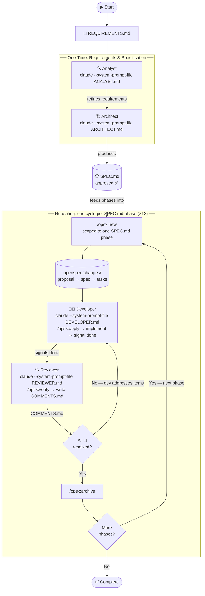

# CLAUDE.md

This file provides guidance to Claude Code (claude.ai/code) when working with code in this repository.

## Project Overview

`ado-to-pa-copypaster` is a **Chrome Extension (Manifest V3)** that lets Project/Product Managers copy Initiative work item data from **Azure DevOps (ADO)** into a **PowerApps model-driven app** form with one click — eliminating manual field-by-field copy-paste.

**Full specification**: `SPEC.md` (approved for implementation, v1.0).
**Target users**: 2–4 PMs. **Target browser**: Chrome 114+.

---

## Current State

Specification is complete and approved. **No source files yet.** Implementation follows the 12-phase plan in `SPEC.md §11`.

---

## Workflow Overview



| File | Persona | Load with |
|---|---|---|
| `ANALYST.md` | Gathers & refines requirements | `claude --system-prompt-file ANALYST.md` |
| `ARCHITECT.md` | Produces `SPEC.md` from requirements | `claude --system-prompt-file ARCHITECT.md` |
| `DEVELOPER.md` | Implements tasks from OpenSpec change | `claude --system-prompt-file DEVELOPER.md` |
| `REVIEWER.md` | Verifies, reviews, and archives | `claude --system-prompt-file REVIEWER.md` |

---

## Architecture

```
Chrome Browser
├── Side Panel UI       sidepanel/index.html + app.js  (Alpine.js v3)
├── Background SW       background/service-worker.js   (tab detection, message routing)
├── ADO content script  scripts/ado-reader.js           (injected on-demand)
├── PA content scripts  scripts/pa-writer.js            (injected on-demand)
│                       scripts/element-picker.js       (injected on-demand)
│                       scripts/selector-tester.js      (injected on-demand)
├── chrome.storage.local  → AppSettings (mappings + overwriteMode)
└── chrome.storage.session → CopiedFieldData[] (clears on browser close)
```

All communication via `chrome.runtime.sendMessage`. Scripts injected via `chrome.scripting.executeScript` (on-demand, not persistent `content_scripts`).

---

## Tech Stack

| Layer | Technology |
|---|---|
| Extension | Chrome MV3 |
| UI | Alpine.js v3 (local file, no CDN) |
| Language | Vanilla JS (ES2020+), HTML5, CSS3 |
| Build | **None** — loaded directly as unpacked extension |
| Tests | Vitest (unit tests for pure logic only) |

---

## File Structure (target)

```
ado-to-pa-copypaster/
├── manifest.json
├── background/service-worker.js
├── sidepanel/index.html, app.js, styles.css
├── scripts/ado-reader.js, pa-writer.js, element-picker.js, selector-tester.js
├── lib/alpine.min.js, selector-generator.js
└── assets/icon-16.png, icon-48.png, icon-128.png
```

No `node_modules`, no bundler output. The extension directory **is** the distributable.

---

## Build & Run

No build step. Load the extension in Chrome:

1. Open `chrome://extensions`
2. Enable **Developer Mode**
3. Click **Load unpacked** → select this directory

To reload after code changes: click the refresh icon on the extension card.

---

## Testing

- **Unit tests** (Vitest): `lib/selector-generator.js` (`generateSelector`), import validation logic, URL ID extraction regex.
- **Manual tests**: See `SPEC.md §9.3` — 24 scenarios covering copy, paste, picker, import/export, overwrite mode.
- No automated E2E tests in v1.

Run unit tests (once `package.json` is added):
```bash
npx vitest run
```

---

## Key Implementation Rules

- **Read `SPEC.md` in full before writing any code.** It is the single source of truth.
- **Check `COMMENTS.md`** (if it exists) and resolve all items before starting new work.
- **TDD by default**: write failing test → implement → refactor. Justify any deviation.
- **Before using any external library/API feature**: search Context7 for current docs.
- **No `form.submit()`, no Save button clicks, no `submit` events** — `pa-writer.js` must never trigger form submission (BR-003).
- **Per-field continue-on-failure** (BR-002): wrap each field in try/catch; one failure must not abort the rest.
- **No build tooling** — keep everything vanilla; the extension loads directly.

---

## Role System Prompts

This repo uses role-specific system prompt files:

| File | Role |
|---|---|
| `DEVELOPER.md` | Implementation agent — follow this when writing code |
| `ARCHITECT.md` | Architect — produces `SPEC.md` from requirements |
| `ANALYST.md` | Analyst — requirements gathering |
| `REVIEWER.md` | Code reviewer — produces `COMMENTS.md` |

When acting as the implementation agent, follow `DEVELOPER.md` conventions precisely.
