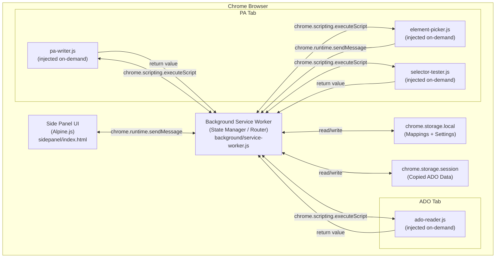
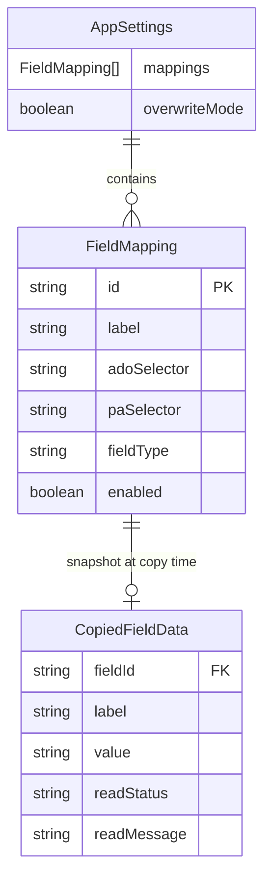

# Project Specification — ADO to PowerApps Copypaster

> **Version**: 1.0
> **Date**: 2026-02-14
> **Status**: Approved for Implementation
> **Audience**: Implementation agent — this document is self-contained and must be read in full before writing any code.

---

## 1. Overview

`ado-to-pa-copypaster` is a **Google Chrome Extension (Manifest V3)** that allows Project Managers and Product Managers to transfer Initiative work item data from **Azure DevOps (ADO)** into a **PowerApps model-driven app** form with one click, eliminating manual field-by-field copy-paste.

The extension provides a persistent **Chrome Side Panel** with two tabs:

- **User Tab** — the daily-use interface: Copy Initiative data from ADO, then Paste it into PowerApps.
- **Admin Tab** — configuration interface: define, edit, delete, export, and import field mappings between ADO and PA.

All logic runs entirely client-side. There is no backend, no external API, and no network calls. Field mapping configuration is stored in `chrome.storage.local`. Copied Initiative data is stored in `chrome.storage.session` (session-scoped, survives service worker termination, cleared on browser close).

**Primary users**: 2–4 Project Managers / Product Managers (semi-technical).
**Target browsers**: Google Chrome 114+.

---

## 2. Goals & Non-Goals

### In Scope (v1)

- Chrome Side Panel UI (persistent across tab switches)
- DOM scraping of 9 Initiative fields from ADO work item pages
- DOM manipulation to populate 3 field interaction types on PA forms: plain text, lookup, combo-select
- Per-field visual status indicators (green / yellow / red / grey) after Copy and Paste
- Admin tab for full mapping CRUD (create, read, update, delete)
- Point-and-click element selector for capturing PA field CSS selectors
- Manual CSS selector input with "Test Selector" live validation
- Export all mappings as a JSON file
- Import mappings from a JSON file (replaces all existing mappings)
- Overwrite Mode toggle (admin setting): controls whether Paste overwrites existing PA field values
- 2 pre-seeded default mappings (Title, Initiative ID) to aid onboarding
- Distribution as an unpacked Chrome extension (Developer Mode)

### Out of Scope (v1)

- ADO REST API integration (DOM scraping only in v1)
- PowerApps record creation (paste into existing open form only)
- Auto-saving the PA record after paste
- Audit logging or transfer history
- Multi-Initiative batch transfers
- Backend server, database, or cloud sync of any kind
- Support for browsers other than Google Chrome
- Support for non-model-driven PowerApps forms
- Chrome Web Store publication
- `chrome.storage.sync` (cross-device config sharing)

---

## 3. Architecture

### 3.1 Component Overview



### 3.2 Key Architectural Decisions

| Decision | Choice | Rationale |
|---|---|---|
| Manifest version | MV3 | Required by Chrome; Side Panel API only available in MV3 |
| UI framework | Alpine.js v3 (local file) | No build step needed; reactive data binding; tiny (~40 KB); works with MV3 CSP |
| Content script injection | On-demand via `chrome.scripting.executeScript` | Scripts injected only when needed; cleaner than persistent content_scripts |
| Session state storage | `chrome.storage.session` | Survives MV3 service worker termination; auto-clears on browser close |
| Persistent config storage | `chrome.storage.local` | Survives browser restarts; per-device storage (no sync) |
| Tab URL detection | `tabs` permission | Required to read URLs in background service worker for page-type detection |
| Communication pattern | Request/Response via `chrome.runtime.sendMessage` | Simple, adequate for this use case; avoids persistent port complexity |

### 3.3 Technology Stack

| Layer | Technology | Version |
|---|---|---|
| Extension platform | Chrome Extension Manifest V3 | — |
| UI framework | Alpine.js | v3.x (latest stable) |
| Languages | HTML5, CSS3, Vanilla JavaScript (ES2020+) | — |
| Side Panel API | `chrome.sidePanel` | Chrome 114+ |
| Storage API | `chrome.storage.local`, `chrome.storage.session` | Chrome 114+ |
| Scripting API | `chrome.scripting` | Chrome 114+ |
| Tabs API | `chrome.tabs` | Chrome 114+ |
| No build step | — | Extension loaded directly as unpacked |

### 3.4 Chrome Permissions

`manifest.json` must declare exactly the following:

```json
{
  "manifest_version": 3,
  "name": "ADO to PowerApps Copypaster",
  "version": "1.0.0",
  "description": "Transfer Initiative data from Azure DevOps to PowerApps in one click.",
  "permissions": [
    "activeTab",
    "storage",
    "scripting",
    "sidePanel",
    "tabs"
  ],
  "host_permissions": [
    "https://dev.azure.com/*",
    "https://*.visualstudio.com/*",
    "https://*.powerapps.com/*",
    "https://*.dynamics.com/*"
  ],
  "background": {
    "service_worker": "background/service-worker.js"
  },
  "side_panel": {
    "default_path": "sidepanel/index.html"
  },
  "action": {
    "default_title": "ADO to PA Copypaster",
    "default_icon": {
      "16": "assets/icon-16.png",
      "48": "assets/icon-48.png",
      "128": "assets/icon-128.png"
    }
  },
  "icons": {
    "16": "assets/icon-16.png",
    "48": "assets/icon-48.png",
    "128": "assets/icon-128.png"
  }
}
```

> **Note on `tabs` permission**: This grants access to tab URL data in the background service worker. It will show as "Read your browsing history" in Chrome — acceptable for this internal team tool. Without it, the background worker cannot inspect tab URLs for page-type detection.

---

## 4. Data Model

### 4.1 Entity Definitions

#### `FieldMapping` (persisted in `chrome.storage.local`)

| Field | Type | Required | Constraints |
|---|---|---|---|
| `id` | `string` (UUID v4) | Yes | Unique; generated on creation |
| `label` | `string` | Yes | Human-readable name, e.g. `"Line of Business"` |
| `adoSelector` | `string` | Yes | CSS selector targeting the value element on the ADO work item page |
| `paSelector` | `string` | Yes | CSS selector targeting the form control on the PA page |
| `fieldType` | `"text" \| "lookup" \| "combo-select"` | Yes | Determines paste interaction strategy (see §6.3) |
| `enabled` | `boolean` | Yes | Default `true`; disabled mappings are skipped during Copy and Paste |

#### `AppSettings` (persisted in `chrome.storage.local` under key `"settings"`)

| Field | Type | Required | Constraints |
|---|---|---|---|
| `mappings` | `FieldMapping[]` | Yes | Ordered array; order is preserved during Copy/Paste |
| `overwriteMode` | `boolean` | Yes | Default `false`; when `false`, existing PA field values are skipped |

#### `CopiedFieldData` (persisted in `chrome.storage.session` under key `"copiedData"`)

| Field | Type | Description |
|---|---|---|
| `fieldId` | `string` | Corresponds to `FieldMapping.id` |
| `label` | `string` | Human-readable field name (snapshot from mapping at copy time) |
| `value` | `string` | The plain-text value read from ADO |
| `readStatus` | `"success" \| "blank" \| "error"` | Result of the read operation |
| `readMessage` | `string \| undefined` | Human-readable detail for blank/error cases |

`chrome.storage.session` stores: `{ copiedData: CopiedFieldData[] | null }`.
`null` means no data has been copied in this session.

#### `FieldResult` (transient — only in UI state, never persisted)

Returned from both `ado-reader.js` (after Copy) and `pa-writer.js` (after Paste).

| Field | Type | Description |
|---|---|---|
| `fieldId` | `string` | Maps to `FieldMapping.id` |
| `label` | `string` | Human-readable field name |
| `status` | `"success" \| "blank" \| "warning" \| "error" \| "skipped"` | Outcome |
| `message` | `string \| undefined` | Shown to the user in the status list |

### 4.2 ER Diagram



### 4.3 Default Seed Mappings

The extension ships with the following 2 pre-seeded `FieldMapping` entries in a `defaults.js` module. They are written to `chrome.storage.local` only on **first install** (checked via `chrome.runtime.onInstalled` with `reason === "install"`). They are best-effort and may require selector adjustment if ADO's DOM changes.

```json
[
  {
    "id": "default-title",
    "label": "Title",
    "adoSelector": "input[aria-label='Title'], textarea[aria-label='Title']",
    "paSelector": "",
    "fieldType": "text",
    "enabled": true
  },
  {
    "id": "default-id",
    "label": "Initiative ID",
    "adoSelector": "__URL_ID__",
    "paSelector": "",
    "fieldType": "text",
    "enabled": true
  }
]
```

> **Special sentinel value `__URL_ID__`**: When `ado-reader.js` encounters `adoSelector === "__URL_ID__"`, it extracts the numeric work item ID from the current page URL using: `window.location.pathname.match(/\/(\d+)(?:[/?#]|$)/)?.[1]`. This is more reliable than a DOM selector for the read-only ID field.

> **`paSelector` is empty** for both defaults — the user must configure the destination selectors via the Admin tab before these mappings are useful.

### 4.4 Mapping Export/Import JSON Schema

Exported file format (human-readable, 2-space indent):

```json
{
  "version": "1.0",
  "exportedAt": "2026-02-14T10:00:00.000Z",
  "overwriteMode": false,
  "mappings": [
    {
      "id": "uuid-v4-string",
      "label": "Line of Business",
      "adoSelector": ".la-labeled-field input",
      "paSelector": "#field_lineofbusiness",
      "fieldType": "lookup",
      "enabled": true
    }
  ]
}
```

**Import validation rules** (see §8.2 for error handling):
- Must be valid JSON
- Must have `"mappings"` as a non-empty array
- Each mapping entry must have: `id` (string), `label` (non-empty string), `adoSelector` (string), `paSelector` (string), `fieldType` in `["text","lookup","combo-select"]`, `enabled` (boolean)
- `version` and `exportedAt` fields are optional and ignored on import
- `overwriteMode` if present is applied to settings on import

---

## 5. API / Interface Contracts

All communication uses `chrome.runtime.sendMessage` / `chrome.runtime.onMessage`. Every message has an `action` string. Responses are returned via the `sendResponse` callback or as the resolved value of the async message handler.

### 5.1 Messages: Side Panel → Background Service Worker

#### `GET_PAGE_CONTEXT`
Asks the background worker what type of page is currently active.

- **Request**: `{ action: "GET_PAGE_CONTEXT" }`
- **Response**: `{ pageType: "ado" | "pa" | "unsupported" }`

---

#### `COPY_INITIATIVE`
Triggers ADO data reading on the current active tab. The background worker injects `ado-reader.js` into the active tab.

- **Request**: `{ action: "COPY_INITIATIVE" }`
- **Response**: `{ success: boolean, results: FieldResult[], error?: string }`
  - `success: false` with `error` if the tab is not an ADO page or injection fails
  - `results` contains one `FieldResult` per enabled mapping

---

#### `GET_COPIED_DATA`
Retrieves the last-copied data from `chrome.storage.session`.

- **Request**: `{ action: "GET_COPIED_DATA" }`
- **Response**: `{ data: CopiedFieldData[] | null }`

---

#### `PASTE_INITIATIVE`
Triggers PA form population on the current active tab.

- **Request**: `{ action: "PASTE_INITIATIVE" }`
- **Response**: `{ success: boolean, results: FieldResult[], error?: string }`
  - `success: false` if the tab is not a PA page or injection fails
  - `results` contains one `FieldResult` per enabled mapping

---

#### `START_ELEMENT_PICKER`
Injects the element picker overlay into the current active tab.

- **Request**: `{ action: "START_ELEMENT_PICKER" }`
- **Response**: `{ success: boolean, error?: string }`

---

#### `CANCEL_ELEMENT_PICKER`
Removes the element picker overlay from the current tab (sends `PICKER_CANCEL` to the injected picker script).

- **Request**: `{ action: "CANCEL_ELEMENT_PICKER" }`
- **Response**: `{ success: boolean }`

---

#### `TEST_SELECTOR`
Injects `selector-tester.js` into the current active tab to validate a CSS selector.

- **Request**: `{ action: "TEST_SELECTOR", selector: string }`
- **Response**: `{ found: boolean, tagName?: string, error?: string }`
  - `tagName` is the tag name of the matched element if found (e.g., `"INPUT"`)

---

#### `GET_SETTINGS`
Reads `AppSettings` from `chrome.storage.local`.

- **Request**: `{ action: "GET_SETTINGS" }`
- **Response**: `{ settings: AppSettings }`

---

#### `SAVE_SETTINGS`
Writes `AppSettings` to `chrome.storage.local`.

- **Request**: `{ action: "SAVE_SETTINGS", settings: AppSettings }`
- **Response**: `{ success: boolean, error?: string }`

---

### 5.2 Messages: Injected Scripts → Background Service Worker

#### `ELEMENT_PICKED` (from `element-picker.js`)

Sent when the user clicks an element in picker mode. The background worker forwards this to the side panel.

- **Message**: `{ action: "ELEMENT_PICKED", selector: string }`
- **Background forwards to Side Panel**: same payload via `chrome.runtime.sendMessage`

---

### 5.3 Messages: Background → Side Panel (Push Notifications)

The background service worker sends push messages to the side panel for two async events. The side panel registers `chrome.runtime.onMessage.addListener` to receive them.

#### `TAB_CHANGED`
Sent when the active tab changes or the URL of the active tab changes (from `chrome.tabs.onActivated` and `chrome.tabs.onUpdated`).

- **Message**: `{ action: "TAB_CHANGED", pageType: "ado" | "pa" | "unsupported" }`

#### `ELEMENT_PICKED` (forwarded from injected script)
- **Message**: `{ action: "ELEMENT_PICKED", selector: string }`

---

## 6. Core Logic & Business Rules

### 6.1 Page Type Detection

The background service worker determines the page type on every tab activation and URL change:

```
URL matches https://dev.azure.com/*/*/_workitems/*
  OR https://*.visualstudio.com/*/_workitems/*
→ pageType = "ado"

URL matches https://*.powerapps.com/*
  OR https://*.dynamics.com/*
→ pageType = "pa"

Otherwise
→ pageType = "unsupported"
```

The check uses `new URL(tab.url)` parsed against these patterns. The result is cached in a module-level variable in the service worker. On `chrome.tabs.onActivated` and `chrome.tabs.onUpdated` (only when `changeInfo.url` or `changeInfo.status === "complete"`), the cache is re-evaluated and a `TAB_CHANGED` push message is sent to the side panel.

**Business Rule BR-004**: Action buttons (Copy, Paste) must be disabled when `pageType === "unsupported"`.

---

### 6.2 Copy Flow (ADO Reader)

Triggered by the `COPY_INITIATIVE` message. The background worker:

1. Gets the active tab ID.
2. Verifies `pageType === "ado"`. If not, returns `{ success: false, error: "Not on an ADO work item page." }`.
3. Loads current `AppSettings` from storage.
4. Filters to `settings.mappings.filter(m => m.enabled)`.
5. Injects `scripts/ado-reader.js` via `chrome.scripting.executeScript`, passing the enabled mappings as an argument.
6. `ado-reader.js` returns an array of `FieldResult`.
7. Converts results to `CopiedFieldData[]` (keeping only `success` and `blank` entries as data — `error` entries have no value to store).
8. Saves `CopiedFieldData[]` to `chrome.storage.session` under key `"copiedData"`.
9. Returns `{ success: true, results: FieldResult[] }` to the side panel.

**`ado-reader.js` logic** (runs in ADO page context, receives `mappings: FieldMapping[]`):

For each mapping:
- If `adoSelector === "__URL_ID__"`: extract work item ID from `window.location.pathname` using regex `/\/(\d+)(?:[/?#]|$)/`.
- Otherwise: `const el = document.querySelector(adoSelector)`.
  - If no element found: `{ status: "error", message: "Element not found (selector: <selector>)" }`.
  - If found: extract value via `el.value || el.textContent?.trim() || ""`.
    - Strip HTML tags: `value.replace(/<[^>]+>/g, " ").replace(/\s+/g, " ").trim()`.
    - If value is empty: `{ status: "blank", message: "Field is blank in ADO" }`.
    - If value non-empty: `{ status: "success", value }`.

Return value: `FieldResult[]`.

**Business Rules**:
- **BR-002**: Continue processing all mappings even if one fails.
- All read operations must be wrapped in try/catch; exceptions produce `status: "error"`.

---

### 6.3 Paste Flow (PA Writer)

Triggered by the `PASTE_INITIATIVE` message. The background worker:

1. Gets the active tab ID.
2. Verifies `pageType === "pa"`. If not, returns `{ success: false, error: "Not on a PowerApps page." }`.
3. Loads current `AppSettings` and `CopiedFieldData[]` from storage.
4. If `copiedData === null`: returns `{ success: false, error: "No copied data. Please copy from ADO first." }`.
5. Injects `scripts/pa-writer.js` via `chrome.scripting.executeScript`, passing `copiedData` and `settings` (mappings + overwriteMode).
6. `pa-writer.js` returns `FieldResult[]`.
7. Returns `{ success: true, results: FieldResult[] }` to side panel.

**`pa-writer.js` logic** (runs in PA page context):

For each enabled mapping (iterate in order, continue on failure per **BR-002**):

1. Find the copied value: `const copied = copiedData.find(d => d.fieldId === mapping.id)`.
   - If not found or `copied.readStatus === "error"`: return `{ status: "skipped", message: "No data was read for this field" }`.

2. Find the destination element: `const el = document.querySelector(mapping.paSelector)`.
   - If not found: return `{ status: "error", message: "Element not found (selector: <selector>)" }`.

3. **Check existing value** (if `overwriteMode === false`):
   - For `text`: if `el.value?.trim()` is non-empty, return `{ status: "skipped", message: "Skipped (field has existing value)" }`.
   - For `lookup` and `combo-select`: if the control already shows a non-empty selected value (see type-specific logic), return `{ status: "skipped", message: "Skipped (field has existing value)" }`.

4. Dispatch interaction based on `mapping.fieldType`:

   **`text`**:
   ```
   el.focus()
   el.value = ""
   dispatch("input", "change") on el
   el.value = copiedValue
   dispatch("input", "change", "keyup") on el
   → return { status: "success" }
   ```
   All events dispatched with `{ bubbles: true }`.

   **`lookup`**:
   ```
   el.focus()
   el.click()
   el.value = copiedValue
   dispatch("input") on el
   Wait up to 3000ms for [role="option"], [role="listbox"] ul li, or .lookup-result to appear
   If timeout → clear el.value, dispatch("input"), return { status: "error", message: "Lookup dropdown did not appear within 3s" }
   Find option whose textContent.trim() === copiedValue (case-insensitive fallback)
   If no match → clear el.value, dispatch("input"), return { status: "warning", message: "No matching option found" }
   option.click()
   → return { status: "success" }
   ```

   **`combo-select`**:
   ```
   el.click()
   Wait up to 3000ms for [role="option"] or [role="listbox"] to appear
   If timeout → return { status: "error", message: "Dropdown did not open within 3s" }
   Find option whose textContent.trim() === copiedValue (case-insensitive fallback)
   If no match → return { status: "warning", message: "No matching option found" }
   option.click()
   → return { status: "success" }
   ```

**`waitForElement(selector, timeout, interval = 100)`** utility (defined in `pa-writer.js`):
```
Returns a Promise that resolves with the first matching element,
or null if timeout (ms) is exceeded.
Polls every `interval` ms.
```

**Business Rules**:
- **BR-001**: Skip fields with existing values when `overwriteMode === false`.
- **BR-002**: Wrap each field interaction in try/catch; exceptions produce `status: "error"`; continue to next field.
- **BR-003**: `pa-writer.js` must NEVER call `form.submit()`, click Save buttons, or dispatch `submit` events.
- **BR-005**: When a lookup finds no match, clear any partially-typed value before returning the warning.

---

### 6.4 Element Picker

Activated when the user clicks "Pick Element" in the Admin tab (requires the active tab to be a PA page — the button is disabled on other pages).

**Flow**:
1. Side Panel sends `START_ELEMENT_PICKER` to background.
2. Background injects `lib/selector-generator.js` then `scripts/element-picker.js` into the active tab (in a single `executeScript` call with `files: ["lib/selector-generator.js", "scripts/element-picker.js"]`).
3. `element-picker.js` adds a full-page transparent overlay `<div id="ado-pa-picker-overlay">` with `pointer-events: none` and `position: fixed; z-index: 2147483647`.
4. Listens for `mouseover` on `document` (not the overlay): outlines the hovered element with `outline: 2px solid #4f9cf9` and `outline-offset: 1px`.
5. Listens for `click` on `document` (with `capture: true`, calling `e.preventDefault()` and `e.stopPropagation()`):
   - Calls `generateSelector(e.target)` from `selector-generator.js`.
   - Removes the overlay and all event listeners.
   - Sends `{ action: "ELEMENT_PICKED", selector }` via `chrome.runtime.sendMessage`.
6. Background forwards `ELEMENT_PICKED` to the side panel.
7. Side panel populates the PA selector input field with the captured selector.
8. Escape key (`keydown` listener on `document`) cancels pick mode: removes overlay, removes listeners. Side panel sends `CANCEL_ELEMENT_PICKER`.

**`generateSelector(el)` algorithm** (in `lib/selector-generator.js`):

Priority order, returning the first that uniquely identifies the element in `document.querySelectorAll`:
1. `#${el.id}` — if `el.id` is non-empty and unique in document.
2. `[data-id="${el.dataset.id}"]` — if `data-id` attribute present and unique.
3. `[data-field-name="${el.dataset.fieldName}"]` — if `data-field-name` present and unique.
4. `[name="${el.name}"]` restricted to tag — e.g., `input[name="title"]` — if unique.
5. `[aria-label="${el.ariaLabel}"]` restricted to tag — if unique.
6. Shortest unique combination of tag + class names (up to 3 classes).
7. Fallback: nth-child path (walk up to `<body>`, building `:nth-child` path).

---

### 6.5 Test Selector

Available in the Admin tab mapping form. Triggered when user clicks "Test Selector" button.

1. Side Panel sends `TEST_SELECTOR` with the current selector string to background.
2. Background injects `scripts/selector-tester.js` into the active tab, passing `selector`.
3. `selector-tester.js`:
   - Runs `document.querySelector(selector)`.
   - If found: adds `outline: 3px solid #22c55e` to the element for 2 seconds, then removes it. Returns `{ found: true, tagName: el.tagName }`.
   - If not found: returns `{ found: false }`.
   - On exception: returns `{ found: false, error: e.message }`.
4. Background returns result to side panel.
5. Side Panel displays inline result below the selector input (see §7.3).

---

### 6.6 Export / Import Mappings

**Export**:
1. Load `AppSettings` from storage.
2. Build export object (see §4.4 schema).
3. Serialize with `JSON.stringify(exportObj, null, 2)`.
4. Create a `Blob` with `type: "application/json"`.
5. Trigger download with filename `ado-pa-mappings.json` via a temporary `<a download>` element.

**Import**:
1. User selects a `.json` file via `<input type="file" accept=".json">`.
2. Read file contents with `FileReader.readAsText`.
3. Attempt `JSON.parse`. On failure → show error, do not modify storage.
4. Validate schema (see §4.4 validation rules). On failure → show error, do not modify storage.
5. Build new `AppSettings`:
   - `mappings`: from imported data.
   - `overwriteMode`: from imported data if present, else retain current value.
6. Save to `chrome.storage.local` (replaces all existing settings).
7. Reload the Admin tab mapping list from the new settings.
8. Show success confirmation.

---

### 6.7 Overwrite Mode

Stored as `AppSettings.overwriteMode` (boolean, default `false`).

- **OFF (default)**: During paste, if the destination PA element already contains a non-empty value, the field is skipped and a grey `"skipped"` status is shown.
- **ON**: Existing values in PA fields are overwritten regardless.

The current mode is displayed as a read-only badge in the User Tab ("Overwrite: ON" / "Overwrite: OFF") so the user is always aware of the active mode before pasting.

---

## 7. User Interface

### 7.1 Side Panel Shell

The side panel renders `sidepanel/index.html`. It uses Alpine.js for reactive state. The root element has `x-data` referencing the global Alpine store `$store.app`.

**Tab navigation**: Two tabs at the top — "User" and "Admin". Active tab is stored in `$store.app.activeTab` (`"user"` or `"admin"`). Tab panels are toggled with `x-show`.

**Side panel width**: Chrome Side Panel default (~400px). Content scrolls vertically. No horizontal scroll.

---

### 7.2 User Tab

#### States and Layout

```
┌─────────────────────────────────────┐
│  [User] [Admin]  ← tab bar          │
├─────────────────────────────────────┤
│  Page Context Banner                │
│  ┌─────────────────────────────┐    │
│  │ 🔵 Azure DevOps Initiative  │    │
│  │    detected. Ready to copy. │    │
│  └─────────────────────────────┘    │
│                                     │
│  Overwrite Mode: [OFF badge]        │
│                                     │
│  [ Copy Initiative ]   ← button     │
│  [ Paste to PowerApps ]← button     │
│                                     │
│  ── Field Status List ──            │
│  ✅ Title              success      │
│  ⚠️  Description       blank        │
│  ❌ Line of Business   not found    │
│  ⬜ Initiative Owner   skipped      │
└─────────────────────────────────────┘
```

#### Page Context Banner

| `pageType` | Icon | Message |
|---|---|---|
| `"ado"` | 🔵 (blue dot) | "Azure DevOps Initiative detected. Ready to copy." |
| `"pa"` | 🟢 (green dot) | "PowerApps form detected. Ready to paste." |
| `"unsupported"` | ⚪ (grey dot) | "This page is not supported. Navigate to an ADO Initiative or a PowerApps form." |

#### Button States

| Button | Enabled when | Disabled when |
|---|---|---|
| Copy Initiative | `pageType === "ado"` | Any other `pageType` |
| Paste to PowerApps | `pageType === "pa"` AND `hasCopiedData === true` | Otherwise |

Both buttons show a spinner and "Copying…" / "Pasting…" label during the operation. Buttons are `disabled` during their operation.

#### Field Status List

Shown after Copy or Paste. One row per enabled mapping, in mapping order.

| `status` | Icon | Label | Extra text |
|---|---|---|---|
| `"success"` | ✅ green checkmark | Field label | — |
| `"blank"` | ⚠️ yellow warning | Field label | "Field is blank in ADO" |
| `"warning"` | ⚠️ yellow warning | Field label | e.g. "No matching option found" |
| `"error"` | ❌ red X | Field label | Short error reason |
| `"skipped"` | ⬜ grey dash | Field label | "Skipped (field has existing value)" |

Icons must be accompanied by text labels (not icon-only) for accessibility.

The list is cleared and replaced on each new Copy or Paste operation. A "Results from: Copy" or "Results from: Paste" header precedes the list.

---

### 7.3 Admin Tab

#### Layout

```
┌─────────────────────────────────────┐
│  [User] [Admin]  ← tab bar          │
├─────────────────────────────────────┤
│  ⚙ Settings                         │
│  Overwrite Mode: [toggle]           │
│                                     │
│  ── Field Mappings ──               │
│  [+ Add Mapping]                    │
│                                     │
│  [Title]          text  [Edit][Del] │
│  [Initiative ID]  text  [Edit][Del] │
│  [Line of Biz]    lookup [Edit][Del]│
│  ...                                │
│                                     │
│  [↓ Export Mappings] [↑ Import]     │
└─────────────────────────────────────┘
```

#### Mapping List

A table/list of all configured mappings (enabled and disabled). Each row shows:
- Label
- Field type badge (`text` / `lookup` / `combo-select`)
- Enabled/disabled toggle (checkbox)
- Edit button → opens the mapping form (inline or modal)
- Delete button → shows a confirmation prompt before deleting

#### Mapping Form (Add / Edit)

Fields:
1. **Label** — text input (required). Human-readable name.
2. **ADO Selector** — text input (required). CSS selector or `__URL_ID__` for the work item ID.
3. **PA Selector** — text input (required) + **"Pick Element"** button.
   - "Pick Element" is only active when the current tab is a PA page (disabled otherwise with tooltip "Navigate to a PowerApps form first").
   - While picker is active: button label changes to "Cancel Pick", outline appears on hovered PA elements.
   - On capture: selector is auto-populated into the PA Selector input.
4. **Field Type** — `<select>` with options: `Text`, `Lookup`, `Combo / Select`.
5. **Test Selector** button — tests the PA selector against the current tab.
   - While running: button disabled, shows "Testing…".
   - Result shown inline below the PA selector input:
     - Found: green "✅ Found: INPUT element" (using `tagName`).
     - Not found: red "❌ No element found with this selector".
     - Error: red "❌ Error: <message>".
6. **Save** button — validates required fields, saves mapping.
7. **Cancel** button — discards changes.

#### Settings

- **Overwrite Mode toggle**: `<input type="checkbox">` labeled "Overwrite Mode — overwrite existing PA field values during paste". Saved immediately on change via `SAVE_SETTINGS`.

#### Export / Import

- **Export Mappings** button: triggers download of `ado-pa-mappings.json`.
- **Import Mappings** button: opens a hidden `<input type="file" accept=".json">`. On file select, validates and imports (replaces all). Shows success or error message inline.

---

### 7.4 Alpine.js Store Shape

```javascript
// Registered in sidepanel/app.js via Alpine.store("app", { ... })
{
  // Navigation
  activeTab: "user",          // "user" | "admin"

  // Page context (updated via TAB_CHANGED push + GET_PAGE_CONTEXT on load)
  pageType: "unsupported",    // "ado" | "pa" | "unsupported"

  // User tab
  copyStatus: "idle",         // "idle" | "copying" | "done"
  pasteStatus: "idle",        // "idle" | "pasting" | "done"
  hasCopiedData: false,
  lastOperation: null,        // "copy" | "paste" | null
  fieldResults: [],           // FieldResult[] — shown in status list

  // Admin tab
  settings: null,             // AppSettings (loaded on mount)
  editingMapping: null,       // FieldMapping | null (null = add mode)
  showMappingForm: false,
  pickerActive: false,
  testSelectorResult: null,   // { found, tagName?, error? } | null
  testSelectorLoading: false,
  importMessage: null,        // { type: "success"|"error", text } | null
}
```

---

## 8. Error Handling

### 8.1 Runtime Error Principles

- Every injected script wraps all logic in `try/catch`. Exceptions return a structured error result — they do not throw to the host page.
- The background service worker wraps all `chrome.scripting.executeScript` calls in try/catch. Chrome API errors return `{ success: false, error: e.message }`.
- The side panel displays user-friendly messages for all error states. Raw error objects or stack traces are never shown in the UI.
- Per **BR-002**: a failure in one field never aborts processing of remaining fields.

### 8.2 Import Validation Errors

On import, if validation fails, show an inline error message in the Admin tab. **Do not modify `chrome.storage.local`.**

| Condition | Error message |
|---|---|
| File is not valid JSON | "Invalid file: could not parse JSON." |
| `mappings` key missing or not an array | "Invalid format: 'mappings' array is required." |
| A mapping entry is missing required fields | "Invalid mapping entry: missing required field '<fieldName>'." |
| `fieldType` is not a valid value | "Invalid fieldType in mapping '<label>': must be text, lookup, or combo-select." |

### 8.3 ADO Reader Errors

| Condition | Result |
|---|---|
| Selector returns no element | `{ status: "error", message: "Element not found (selector: <selector>)" }` |
| URL ID extraction fails (no number in URL) | `{ status: "error", message: "Could not extract work item ID from URL" }` |
| Unexpected JS exception | `{ status: "error", message: "Unexpected error: <e.message>" }` |
| Field element found but value is empty/whitespace | `{ status: "blank", message: "Field is blank in ADO" }` |

### 8.4 PA Writer Errors

| Condition | Result |
|---|---|
| Selector returns no element | `{ status: "error", message: "Element not found (selector: <selector>)" }` |
| Lookup dropdown timeout | `{ status: "error", message: "Lookup dropdown did not appear within 3s" }` |
| Combo dropdown timeout | `{ status: "error", message: "Dropdown did not open within 3s" }` |
| No matching option in lookup/combo | `{ status: "warning", message: "No matching option found" }` |
| Field skipped (has value, overwrite OFF) | `{ status: "skipped", message: "Skipped (field has existing value)" }` |
| No copied data for this field | `{ status: "skipped", message: "No data was read for this field" }` |
| Unexpected JS exception | `{ status: "error", message: "Unexpected error: <e.message>" }` |

### 8.5 General UI Error States

- If `COPY_INITIATIVE` or `PASTE_INITIATIVE` returns `success: false` (tab type mismatch, injection failure): show a banner error in the User Tab above the field list.
- If `SAVE_SETTINGS` fails: show an inline error in the Admin tab.
- If `chrome.storage` quota is exceeded: unlikely given small data size, but catch and display "Storage error: <message>".

---

## 9. Testing Requirements

### 9.1 Testing Strategy

This is a UI-heavy Chrome extension targeting a small team. Testing is primarily **manual**, supplemented by **unit tests** for pure logic functions.

- **Unit tests**: Use **Vitest** (or Jest) for pure JS functions that can run in Node.js.
  - `lib/selector-generator.js` — `generateSelector` algorithm
  - Import validation logic
  - Field value extraction logic (pure functions extractable from `ado-reader.js`)
- **Manual testing**: All E2E flows tested against real ADO and PA environments.
- **No automated E2E** in v1 (complexity of injecting into real ADO/PA pages is out of scope).

### 9.2 Unit Test Coverage Goals

- `generateSelector`: ≥ 90% branch coverage. Test each priority level (id, data-id, name, aria-label, class combination, nth-child fallback).
- Import validation: 100% of validation rules covered by test cases.
- URL ID extraction regex: all variants (trailing slash, query param, hash).

### 9.3 Manual Test Scenarios

| ID | Scenario | Expected Outcome |
|---|---|---|
| MT-01 | Copy on a fully populated ADO Initiative (all 9 fields filled) | All fields show green ✅ |
| MT-02 | Copy on an ADO Initiative with some blank fields | Blank fields show yellow ⚠️; filled fields show green ✅ |
| MT-03 | Copy on an ADO page where a selector matches no element | Affected field shows red ❌ with "Element not found" |
| MT-04 | Paste all text fields to PA form | All text fields populated; green ✅ |
| MT-05 | Paste a lookup field with exact case-match value | Lookup populated; green ✅ |
| MT-06 | Paste a lookup field with case-insensitive match | Lookup populated; green ✅ |
| MT-07 | Paste a lookup field with no matching option | Field left blank; yellow ⚠️ "No matching option found" |
| MT-08 | Paste when PA field already has value (Overwrite OFF) | Field skipped; grey ⬜ |
| MT-09 | Paste when PA field already has value (Overwrite ON) | Field overwritten; green ✅ |
| MT-10 | Trigger Copy on unsupported page | "Copy Initiative" button is disabled |
| MT-11 | Trigger Paste with no copied data | "Paste to PowerApps" button is disabled |
| MT-12 | Switch from ADO tab to PA tab — sidebar persists data | Copied data and field statuses still visible; Paste button enabled |
| MT-13 | Import valid JSON mapping file | Mappings replace existing; success message shown |
| MT-14 | Import malformed JSON file | Error shown; existing mappings unchanged |
| MT-15 | Import JSON with missing required fields | Validation error shown; existing mappings unchanged |
| MT-16 | Export mappings | Valid `.json` file downloaded; re-importable |
| MT-17 | Point-and-click element selector on PA page | Selector captured and populated in PA Selector input |
| MT-18 | Test Selector with valid selector on PA page | Green "Found: INPUT element" shown; element highlighted briefly |
| MT-19 | Test Selector with invalid selector | Red "No element found" shown |
| MT-20 | Cancel element picker with Escape key | Picker overlay removed; no selector captured |
| MT-21 | Add, edit, delete a mapping in Admin tab | Changes persisted to local storage correctly |
| MT-22 | Overwrite Mode toggle — verify User Tab badge updates | Badge reflects current mode immediately |
| MT-23 | Extension loads in Chrome 114+ with no errors | No console errors; sidebar opens within 500ms |
| MT-24 | Lookup dropdown takes >3s to appear | Timeout; red ❌ "Lookup dropdown did not appear within 3s" |

---

## 10. File & Folder Structure

```
ado-to-pa-copypaster/
│
├── manifest.json                  # MV3 extension manifest (see §3.4)
│
├── background/
│   └── service-worker.js          # Background service worker: tab detection,
│                                  # state management, message routing,
│                                  # chrome.scripting orchestration
│
├── sidepanel/
│   ├── index.html                 # Side panel shell: tab bar, User tab, Admin tab
│   ├── app.js                     # Alpine.js store definition + message listener setup
│   └── styles.css                 # Side panel styles (tab layout, status indicators,
│                                  # form controls, badges, spinner)
│
├── scripts/
│   ├── ado-reader.js              # Injected into ADO tabs. Reads DOM values for all
│   │                              # enabled mappings. Returns FieldResult[].
│   ├── pa-writer.js               # Injected into PA tabs. Populates form fields using
│   │                              # text/lookup/combo-select strategies. Returns FieldResult[].
│   ├── element-picker.js          # Injected into PA tabs. Adds hover overlay, captures
│   │                              # clicked element selector, sends ELEMENT_PICKED message.
│   └── selector-tester.js         # Injected into current tab. Tests a CSS selector,
│                                  # highlights matched element briefly. Returns result.
│
├── lib/
│   ├── alpine.min.js              # Alpine.js v3 (local copy, no CDN)
│   └── selector-generator.js      # generateSelector(el) function. Used by element-picker.js
│                                  # (injected first in same executeScript call). Also
│                                  # importable as a module in other lib files if needed.
│
├── assets/
│   ├── icon-16.png                # Extension icon (16×16)
│   ├── icon-48.png                # Extension icon (48×48)
│   └── icon-128.png               # Extension icon (128×128)
│
└── README.md                      # Installation guide, usage guide, mapping config guide
```

**Notes**:
- No `node_modules`, no build artifacts, no bundler. The extension is loaded directly from this directory as an unpacked extension.
- `lib/alpine.min.js` must be downloaded from the Alpine.js v3 GitHub releases and placed here before the extension can be loaded.
- All scripts use ES2020 features (optional chaining, nullish coalescing, async/await). No transpilation needed for Chrome 114+.

---

## 11. Implementation Plan

### Phase 1 — Project Scaffold

**Goal**: A loadable (but non-functional) extension skeleton.

1. Create `manifest.json` with all permissions, host_permissions, background, side_panel, action, and icons fields (see §3.4).
2. Create placeholder icon files (`assets/icon-16.png`, `icon-48.png`, `icon-128.png`) — use any 16×16, 48×48, 128×128 PNG images.
3. Create `sidepanel/index.html` with a bare `<div>Hello</div>` and an Alpine.js `<script>` import.
4. Create `background/service-worker.js` with a single `console.log("SW started")`.
5. Load the extension in Chrome via `chrome://extensions` → Developer Mode → "Load unpacked". Verify it loads without errors and the side panel opens when the extension icon is clicked.

---

### Phase 2 — Background Service Worker: Tab Detection & Messaging

**Goal**: Background worker detects page type and notifies the side panel.

1. Implement `detectPageType(url: string): "ado" | "pa" | "unsupported"` in `service-worker.js` using URL pattern matching (§6.1).
2. Listen on `chrome.tabs.onActivated` and `chrome.tabs.onUpdated` (filter: `changeInfo.status === "complete"` or `changeInfo.url`). On event: get tab URL, run `detectPageType`, cache result, send `TAB_CHANGED` push to all side panel contexts via `chrome.runtime.sendMessage`.
3. Handle `GET_PAGE_CONTEXT` message: return `{ pageType }` from cache.
4. Handle `chrome.action.onClicked`: call `chrome.sidePanel.open({ windowId: tab.windowId })`.

---

### Phase 3 — Side Panel Shell & Navigation

**Goal**: Side panel renders with two tabs and reactive Alpine.js state.

1. Download `alpine.min.js` (v3 latest) and place in `lib/`.
2. Build `sidepanel/index.html`: tab bar (User / Admin), two tab panels with `x-show`.
3. Build `sidepanel/app.js`: register `Alpine.store("app", { ... })` with full shape (§7.4).
4. On Alpine init: send `GET_PAGE_CONTEXT` to background, update `$store.app.pageType`.
5. Register `chrome.runtime.onMessage` listener for `TAB_CHANGED` → update `pageType`.
6. Build `sidepanel/styles.css`: tab bar, basic layout, placeholder for status indicators.
7. Verify tab switching works and `pageType` updates when switching browser tabs.

---

### Phase 4 — Storage & Settings Foundation

**Goal**: `AppSettings` reads/writes and the 2 default mappings are seeded on install.

1. In `service-worker.js`, handle `chrome.runtime.onInstalled` with `reason === "install"`: write default `AppSettings` to `chrome.storage.local` (2 default mappings from §4.3, `overwriteMode: false`). Skip if settings already exist (for re-installs/updates).
2. Handle `GET_SETTINGS` message: read `chrome.storage.local`, return `{ settings }`.
3. Handle `SAVE_SETTINGS` message: write to `chrome.storage.local`, return `{ success: true }`.
4. Verify defaults appear in storage after a clean install (use Chrome DevTools → Application → Local Storage).

---

### Phase 5 — Admin Tab: Mapping CRUD

**Goal**: Full mapping management UI (no picker, no test selector yet).

1. In the Admin tab panel, load settings on mount (`GET_SETTINGS`), populate `$store.app.settings`.
2. Render mapping list: label, fieldType badge, enabled toggle, Edit/Delete buttons.
3. Implement "Add Mapping" and "Edit" — show mapping form with: Label, ADO Selector, PA Selector, Field Type dropdown. Form validation (all fields required).
4. On Save: update `settings.mappings` in store, send `SAVE_SETTINGS` to background, refresh list.
5. On Delete: confirm via `window.confirm` (or inline confirmation), update store, save.
6. Implement Overwrite Mode toggle: bound to `settings.overwriteMode`, saves immediately on change.
7. Verify CRUD operations persist across page reloads.

---

### Phase 6 — Export / Import

**Goal**: Mappings can be exported and imported via JSON file.

1. Implement Export: serialize `AppSettings` to JSON, trigger download of `ado-pa-mappings.json`.
2. Implement Import: file picker → `FileReader` → JSON parse → validation (§4.4) → `SAVE_SETTINGS` → refresh list.
3. Test with: valid file, malformed JSON, valid JSON with missing fields.

---

### Phase 7 — ADO Reader Script

**Goal**: Copy flow reads ADO fields and stores results.

1. Write `scripts/ado-reader.js`: accepts `mappings` as injected argument, iterates, reads DOM values, handles `__URL_ID__` sentinel, strips HTML, returns `FieldResult[]`. All in try/catch per field.
2. In `service-worker.js`, handle `COPY_INITIATIVE`:
   - Verify `pageType === "ado"`.
   - Load settings, filter enabled mappings.
   - `chrome.scripting.executeScript` with `ado-reader.js` and mapped args.
   - Convert to `CopiedFieldData[]`, write to `chrome.storage.session`.
   - Return `{ success, results }` to side panel.
3. Handle `GET_COPIED_DATA`: read from `chrome.storage.session`, return data.
4. In User Tab: wire "Copy Initiative" button to send `COPY_INITIATIVE`, display results in field status list. Show spinner during operation.
5. Verify green/yellow/red indicators render correctly after copy.

---

### Phase 8 — Element Picker

**Goal**: Point-and-click selector capture works on PA pages.

1. Write `lib/selector-generator.js`: export `generateSelector(el)` with priority algorithm (§6.4). Make it a non-module script (no `export` — it defines `window.generateSelector`).
2. Write `scripts/element-picker.js`: overlay `<div>`, `mouseover` highlights, `click` captures, `keydown` Escape cancels. Sends `ELEMENT_PICKED` or cleans up on cancel.
3. In `service-worker.js`:
   - Handle `START_ELEMENT_PICKER`: inject `["lib/selector-generator.js", "scripts/element-picker.js"]` into active tab.
   - Handle `ELEMENT_PICKED` from injected script: forward to side panel.
   - Handle `CANCEL_ELEMENT_PICKER`: execute a cleanup script that removes the overlay.
4. In Admin Tab mapping form: wire "Pick Element" button → `START_ELEMENT_PICKER`. Handle `ELEMENT_PICKED` → populate PA Selector input. Show "Cancel Pick" state. Disable button when `pageType !== "pa"`.
5. Test: activate picker, hover elements, click to capture, verify selector populated.

---

### Phase 9 — Test Selector

**Goal**: CSS selector can be validated live against the current page.

1. Write `scripts/selector-tester.js`: accepts `selector`, runs `document.querySelector`, highlights found element, returns result.
2. In `service-worker.js`, handle `TEST_SELECTOR`: inject `selector-tester.js` with selector arg, return result.
3. In Admin Tab mapping form: wire "Test Selector" button → `TEST_SELECTOR` → display inline result (§7.3).

---

### Phase 10 — PA Writer Script

**Goal**: Paste flow populates PA form fields.

1. Write `scripts/pa-writer.js`: implements `text`, `lookup`, and `combo-select` interaction strategies (§6.3). Includes `waitForElement` utility. Returns `FieldResult[]`. Respects `overwriteMode`.
2. In `service-worker.js`, handle `PASTE_INITIATIVE`:
   - Verify `pageType === "pa"`.
   - Load settings and `copiedData` from storage.
   - If `copiedData === null`: return error.
   - Inject `pa-writer.js` with data + settings.
   - Return `{ success, results }`.
3. In User Tab: wire "Paste to PowerApps" button → `PASTE_INITIATIVE` → display field results. Button only enabled when `pageType === "pa" && hasCopiedData`. Show spinner during operation.
4. Display Overwrite Mode badge in User Tab (read-only).
5. Test all three field types, skip/overwrite behavior, timeout behavior.

---

### Phase 11 — Integration, Polish & Hardening

**Goal**: All flows work end-to-end; edge cases handled; accessibility complete.

1. **Tab-switch persistence**: Verify `hasCopiedData` is re-checked from `chrome.storage.session` on every `TAB_CHANGED` event. Side panel should correctly re-enable Paste button when switching to a PA tab after copying.
2. **Accessibility**: Ensure all status icons have accompanying text labels (no icon-only indicators). All interactive elements are keyboard-focusable. Contrast ratios meet WCAG AA.
3. **Edge cases**:
   - Extension sidebar opened on an unsupported page on first load.
   - User reloads the ADO or PA page while the picker is active.
   - Service worker wakes from termination — verify `copiedData` survives via `chrome.storage.session`.
   - Zero mappings configured — Copy/Paste with empty mapping list shows a clear message.
4. **Console hygiene**: Remove all `console.log` debug statements. Keep only `console.error` for genuine errors.
5. **UX polish**: Loading states, empty states (no mappings yet), transition between idle/done states.

---

### Phase 12 — Documentation & Delivery

**Goal**: Extension is ready for team distribution.

1. Write `README.md`:
   - Installation instructions (load unpacked via `chrome://extensions`).
   - Usage guide: Copy flow, Paste flow with screenshots.
   - Admin guide: configuring mappings, using point-and-click picker.
   - JSON mapping schema reference.
   - Troubleshooting: selectors not working, lookup not matching.
2. Final manual testing pass against all 24 test scenarios (§9.3).
3. Package as a zip for sharing: zip the extension directory (excluding any dev files).

---

## 12. Open Questions

| # | Question | Owner | Impact |
|---|---|---|---|
| OQ-01 | **ADO CSS selectors for 7 non-default fields**: The 7 Initiative fields beyond Title and ID (Line of Business, Initiative Owner, Engineering Lead, T-shirt Size, Planned Roadmap, Roadmap Year, Description) require CSS selectors to be determined by inspecting the real ADO page in Chrome DevTools. These must be configured by the user via the Admin tab before the extension is useful. | User (PM) | Must be done before the extension can be used in production |
| OQ-02 | **PA CSS selectors for all 9 fields**: All PA destination field selectors must be configured via the Admin tab point-and-click picker or manual entry. None are shipped as defaults. | User (PM) | Must be done before the extension can be used in production |
| OQ-03 | **PowerApps custom control DOM structure**: PA model-driven app lookup and combo-select controls may use a variety of DOM patterns depending on the PowerApps version and control type. The selectors used in `pa-writer.js` for dropdown results (`[role="option"]`, `[role="listbox"]`) are best-effort and must be validated against the actual PA environment. Adjustment may be needed. | Implementation agent | Adjust `pa-writer.js` interaction strategies during Phase 10 based on actual PA DOM inspection |
| OQ-04 | **Custom PowerApps domains**: If the PA app is hosted on a custom domain (not `*.powerapps.com` or `*.dynamics.com`), the extension's `host_permissions` must be updated and the page type detection URL pattern (§6.1) must be extended. | User (PM / IT) | Low impact for now; easy to extend if needed |

---

*End of Specification*
