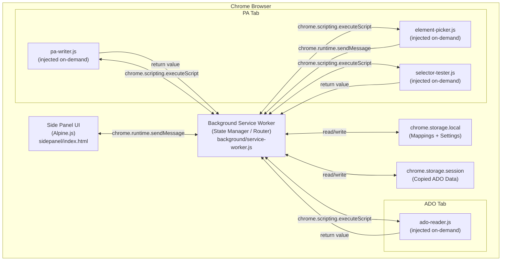
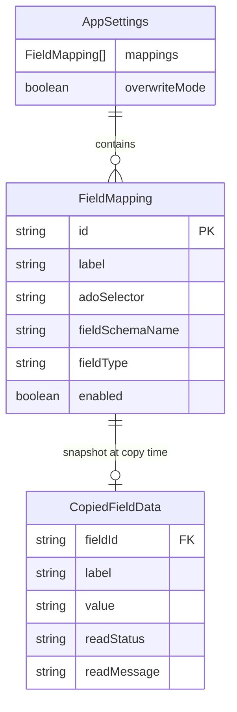

# Project Specification — ADO to PowerApps Copypaster

> **Version**: 1.5
> **Date**: 2026-02-14 (amended 2026-02-15, 2026-02-16)
> **Status**: Approved for Implementation
> **Audience**: Implementation agent — this document is self-contained and must be read in full before writing any code.
>
> **v1.1 amendments** (2026-02-15): (1) §3.2 — added `@alpinejs/csp` build decision and `$store` mutation constraint; (2) §3.3 — Alpine.js stack entry updated to `@alpinejs/csp`; (3) §4.3 — replaced `reason === "install"` guard with read-before-write guard; (4) §7.4 — added `setTab()` method to Alpine store shape; (5) §10 — `lib/alpine.min.js` must be the CSP build; (6) §11 Phase 3 step 1 — updated Alpine download instruction; (7) §11 Phase 4 step 1 — removed reason filter, documented read-before-write pattern.
>
> **v1.2 amendments** (2026-02-15 — based on SPIKE-PA-STRATEGIES.md live DOM inspection): (1) §3.2 — added PA-specific architectural constraints (data-id stability, React synthetic events, Fluent UI portal); (2) §4.1 — `FieldMapping.paSelector` replaced by `fieldSchemaName`; `combo-select` renamed to `choice`; (3) §4.2 — ER diagram updated; (4) §4.3 — default seed shape updated; (5) §4.4 — export/import schema and validation updated; (6) §5.1 — `TEST_SELECTOR` request updated; (7) §5.2/§5.3 — `ELEMENT_PICKED` payload changed from `selector` to `schemaName`; (8) §6.3 — paste strategies completely rewritten with real PA DOM contracts; (9) §6.4 — element picker now extracts schema name from `data-id`; `selector-generator.js` removed; (10) §6.5 — test field updated; (11) §7.3 — mapping form PA Selector replaced with Field Schema Name; (12) §8.2/§8.4 — error tables updated; (13) §9 — test coverage updated; (14) §10 — `selector-generator.js` removed, `pa-selectors.js` added; (15) §11 Phases 5/8/9/10 — implementation steps updated; (16) §12 — open questions updated.
>
> **v1.3 amendments** (2026-02-16 — Phase 9 scope expansion): (1) §5.1 — added `TEST_ADO_SELECTOR` message; (2) §6.5 — expanded "Test Field" section to cover ADO selector testing alongside PA field testing; (3) §7.3 — added "Test ADO" button next to `adoSelector` input in mapping form; (4) §9 — added MT-19a / MT-19b test matrix rows for ADO selector testing; (5) §11 Phase 9 — updated implementation steps to include ADO test path.
>
> **v1.4 amendments** (2026-02-16 — ENHANCEMENTS.01.md: User Tab UI overhaul): (1) §2 — added always-visible field list, per-field copy/paste state badges, Clear action, and context banner colour styling to in-scope goals; (2) §4.1 — added `FieldUIState` derived entity; `CopiedFieldData` now stores ALL copy outcomes including `error` entries; (3) §5.1 — added `CLEAR_COPIED_DATA` message contract; (4) §6.2 — step 7 updated: all copy outcomes (including errors) are persisted to session storage; (5) §7.2 — User Tab completely redesigned: always-visible field list derived from mappings, per-field state badges (NOT COPIED / COPIED / FAILED / PASTED / SKIPPED), Clear button, updated context banner colours, updated button styling (heights, colours, font size); (6) §7.4 — Alpine store updated with `enabledMappings`, `fieldUIStates`, `lastPasteResults` properties and `clearCopiedData()`, `deriveFieldUIStates()` methods; (7) §9.3 — added MT-28 through MT-34 manual test scenarios; (8) §11 Phase 11 — expanded with all UI enhancement implementation tasks.
>
> **v1.5 amendments** (2026-02-16 — Phase 11 last-minute QA fixes + UX polish): (1) §7.3 Mapping Form — added rule: **edit mode must preserve the existing `enabled` flag**; `saveMapping()` merges `formData` on top of the existing mapping object so fields not present in the form (i.e. `enabled`) are never reset; (2) §6.2 implementation note — `updateAfterCopy()` in `sidepanel/app.js` must include `readMessage` for `error`/`blank` results when building the in-memory `CopiedFieldData[]` — required so `deriveFieldUIStates()` can produce the correct secondary-line text for `copy_failed` rows (MT-30 regression fix); (3) §7.2 UX tweaks — context banner `font-size` 15px, banner `margin-bottom` 0, overwrite badge row `padding` 18px 12px, field badge `font-size` 8px, `badge--not-copied` background tint `#0000000f`, field secondary line `width` 88%.

---

## 1. Overview

`ado-to-pa-copypaster` is a **Google Chrome Extension (Manifest V3)** that allows Project Managers and Product Managers to transfer Initiative work item data from **Azure DevOps (ADO)** into a **PowerApps model-driven app** form with one click, eliminating manual field-by-field copy-paste.

The extension provides a persistent **Chrome Side Panel** with two tabs:

- **User Tab** — the daily-use interface: Copy Initiative data from ADO, then Paste it into PowerApps.
- **Admin Tab** — configuration interface: define, edit, delete, export, and import field mappings between ADO and PA.

All logic runs entirely client-side. There is no backend, no external API, and no network calls. Field mapping configuration is stored in `chrome.storage.local`. Copied Initiative data is stored in `chrome.storage.session` (session-scoped, survives service worker termination, cleared on browser close).

**Primary users**: 2–4 Project Managers / Product Managers (semi-technical).
**Target browsers**: Google Chrome 114+.

---

## 2. Goals & Non-Goals

### In Scope (v1)

- Chrome Side Panel UI (persistent across tab switches)
- DOM scraping of 9 Initiative fields from ADO work item pages
- DOM manipulation to populate 3 field interaction types on PA forms: `text`, `lookup`, `choice`
- Per-field visual status indicators after Copy and Paste: always-visible field list with state badges (NOT COPIED / COPIED / FAILED / PASTED / SKIPPED), copied values, and error/reason messages
- Clear button in User Tab to reset copied session data and return all fields to NOT COPIED state
- Context banners with brand-accurate colour styling: Azure DevOps (blue), PowerApps (purple), Unsupported (grey)
- Admin tab for full mapping CRUD (create, read, update, delete)
- Point-and-click element selector for capturing PA field CSS selectors
- Manual CSS selector input with "Test Selector" live validation
- Export all mappings as a JSON file
- Import mappings from a JSON file (replaces all existing mappings)
- Overwrite Mode toggle (admin setting): controls whether Paste overwrites existing PA field values
- 2 pre-seeded default mappings (Title, Initiative ID) to aid onboarding
- Distribution as an unpacked Chrome extension (Developer Mode)

### Out of Scope (v1)

- ADO REST API integration (DOM scraping only in v1)
- PowerApps record creation (paste into existing open form only)
- Auto-saving the PA record after paste
- Audit logging or transfer history
- Multi-Initiative batch transfers
- Backend server, database, or cloud sync of any kind
- Support for browsers other than Google Chrome
- Support for non-model-driven PowerApps forms
- Chrome Web Store publication
- `chrome.storage.sync` (cross-device config sharing)

---

## 3. Architecture

### 3.1 Component Overview



### 3.2 Key Architectural Decisions

| Decision | Choice | Rationale |
|---|---|---|
| Manifest version | MV3 | Required by Chrome; Side Panel API only available in MV3 |
| UI framework | Alpine.js v3 — **`@alpinejs/csp` build** (local file) | No build step needed; reactive data binding; tiny (~40 KB). Standard Alpine build uses `new AsyncFunction` at runtime, which is blocked by Chrome MV3's default CSP (`unsafe-eval` not allowed). The `@alpinejs/csp` build replaces expression evaluation with a CSP-compliant custom parser. |
| Alpine.js `$store` mutation | Store methods only (e.g. `setTab(tab)`) — never direct property assignment from directive expressions | The `@alpinejs/csp` parser handles `$store` reads but **silently drops assignments** made from directive expressions (e.g. `$store.app.activeTab = 'admin'` in `@click` does nothing — no error is thrown). All store mutations triggered from directives **must go through explicit store methods**. |
| Content script injection | On-demand via `chrome.scripting.executeScript` | Scripts injected only when needed; cleaner than persistent content_scripts |
| Session state storage | `chrome.storage.session` | Survives MV3 service worker termination; auto-clears on browser close |
| Persistent config storage | `chrome.storage.local` | Survives browser restarts; per-device storage (no sync) |
| Tab URL detection | `tabs` permission | Required to read URLs in background service worker for page-type detection |
| Communication pattern | Request/Response via `chrome.runtime.sendMessage` | Simple, adequate for this use case; avoids persistent port complexity |
| PA field identification | `data-id` attribute (field schema name prefix) — **never `id` attributes** | PA element `id` attributes contain session-specific GUIDs (e.g. `id-6927649b-...`) that change on every page load. `data-id` attributes are stable and predictable: `{fieldSchemaName}.fieldControl-{controlType}_{...}`. Always derive PA selectors from `fieldSchemaName` at runtime. |
| PA value writing | `simulateTyping` via `document.execCommand` / native setter — **never `el.value = x`** | PowerApps uses React's synthetic event system. Direct `el.value = x` assignments are silently ignored. Must use `document.execCommand('insertText', false, text)` (fires a proper InputEvent React detects), with fallback to native `HTMLInputElement.prototype.value` setter + event dispatch. |
| PA choice dropdown options | Query from `document.querySelectorAll('[role="option"]')` — **never from within the field container** | PowerApps uses Fluent UI. When a choice combobox is opened, its options render in a detached portal (`<div id="__fluentPortalMountNode">`) that is not a child of the combobox element in the DOM. Querying within the field container finds nothing. Always query from the document root. |
| PA lookup result waiting | MutationObserver — **never `setInterval` polling** | Lookup search results come from a Dataverse API call (500ms–2s latency). MutationObserver is event-driven and resolves the instant results appear; polling wastes CPU and either times out too early or adds unnecessary delay. |

### 3.3 Technology Stack

| Layer | Technology | Version |
|---|---|---|
| Extension platform | Chrome Extension Manifest V3 | — |
| UI framework | Alpine.js — `@alpinejs/csp` build | v3.x (latest stable) — **must use the `@alpinejs/csp` build**, not the standard build. See §3.2 for rationale and mutation constraint. |
| Languages | HTML5, CSS3, Vanilla JavaScript (ES2020+) | — |
| Side Panel API | `chrome.sidePanel` | Chrome 114+ |
| Storage API | `chrome.storage.local`, `chrome.storage.session` | Chrome 114+ |
| Scripting API | `chrome.scripting` | Chrome 114+ |
| Tabs API | `chrome.tabs` | Chrome 114+ |
| No build step | — | Extension loaded directly as unpacked |

### 3.4 Chrome Permissions

`manifest.json` must declare exactly the following:

```json
{
  "manifest_version": 3,
  "name": "ADO to PowerApps Copypaster",
  "version": "1.0.0",
  "description": "Transfer Initiative data from Azure DevOps to PowerApps in one click.",
  "permissions": [
    "activeTab",
    "storage",
    "scripting",
    "sidePanel",
    "tabs"
  ],
  "host_permissions": [
    "https://dev.azure.com/*",
    "https://*.visualstudio.com/*",
    "https://*.powerapps.com/*",
    "https://*.dynamics.com/*"
  ],
  "background": {
    "service_worker": "background/service-worker.js"
  },
  "side_panel": {
    "default_path": "sidepanel/index.html"
  },
  "action": {
    "default_title": "ADO to PA Copypaster",
    "default_icon": {
      "16": "assets/icon-16.png",
      "48": "assets/icon-48.png",
      "128": "assets/icon-128.png"
    }
  },
  "icons": {
    "16": "assets/icon-16.png",
    "48": "assets/icon-48.png",
    "128": "assets/icon-128.png"
  }
}
```

> **Note on `tabs` permission**: This grants access to tab URL data in the background service worker. It will show as "Read your browsing history" in Chrome — acceptable for this internal team tool. Without it, the background worker cannot inspect tab URLs for page-type detection.

---

## 4. Data Model

### 4.1 Entity Definitions

#### `FieldMapping` (persisted in `chrome.storage.local`)

| Field | Type | Required | Constraints |
|---|---|---|---|
| `id` | `string` (UUID v4) | Yes | Unique; generated on creation |
| `label` | `string` | Yes | Human-readable name, e.g. `"Line of Business"` |
| `adoSelector` | `string` | Yes | CSS selector targeting the value element on the ADO work item page |
| `fieldSchemaName` | `string` | Yes | The PA field's schema name (e.g. `shg_solutionfamily`). All PA `data-id` selectors are derived from this at runtime (see §6.3). Never configure a raw CSS selector for PA — PA `id` attributes are session-specific GUIDs. |
| `fieldType` | `"text" \| "lookup" \| "choice"` | Yes | Determines paste interaction strategy (see §6.3). `text` = plain text input; `lookup` = relationship lookup (searches Dataverse); `choice` = option-set combobox (fixed list). |
| `enabled` | `boolean` | Yes | Default `true`; disabled mappings are skipped during Copy and Paste |

#### `AppSettings` (persisted in `chrome.storage.local` under key `"settings"`)

| Field | Type | Required | Constraints |
|---|---|---|---|
| `mappings` | `FieldMapping[]` | Yes | Ordered array; order is preserved during Copy/Paste |
| `overwriteMode` | `boolean` | Yes | Default `false`; when `false`, existing PA field values are skipped |

#### `CopiedFieldData` (persisted in `chrome.storage.session` under key `"copiedData"`)

| Field | Type | Description |
|---|---|---|
| `fieldId` | `string` | Corresponds to `FieldMapping.id` |
| `label` | `string` | Human-readable field name (snapshot from mapping at copy time) |
| `value` | `string` | The plain-text value read from ADO. Empty string `""` for `error` and `blank` entries. |
| `readStatus` | `"success" \| "blank" \| "error"` | Result of the read operation |
| `readMessage` | `string \| undefined` | Human-readable detail for `blank` and `error` cases |

`chrome.storage.session` stores: `{ copiedData: CopiedFieldData[] | null }`.
`null` means no data has been copied in this session.

> **v1.4 change**: ALL copy outcomes are persisted — including `readStatus === "error"` entries. Previously only `success` and `blank` entries were stored. Error entries carry `value: ""` and `readMessage` with the error text, enabling the UI to display the FAILED badge and error message for the field row without re-running the copy.

#### `FieldUIState` (derived — in Alpine store memory only, never persisted)

Computed by `deriveFieldUIStates()` in `sidepanel/app.js` from `enabledMappings` + `copiedData` + `lastPasteResults`. One entry per enabled mapping. Drives all field row rendering in the User Tab (see §7.2).

| Field | Type | Description |
|---|---|---|
| `fieldId` | `string` | Corresponds to `FieldMapping.id` |
| `label` | `string` | `FieldMapping.label` |
| `state` | `"not_copied" \| "copied" \| "copy_failed" \| "pasted" \| "paste_failed" \| "skipped"` | Current display state |
| `copiedValue` | `string \| null` | Value read from ADO; `null` when state is `not_copied` or `copy_failed` |
| `message` | `string \| null` | Error or reason text; populated for `copy_failed`, `paste_failed`, `skipped` |

#### `FieldResult` (transient — only in UI state, never persisted)

Returned from both `ado-reader.js` (after Copy) and `pa-writer.js` (after Paste).

| Field | Type | Description |
|---|---|---|
| `fieldId` | `string` | Maps to `FieldMapping.id` |
| `label` | `string` | Human-readable field name |
| `status` | `"success" \| "blank" \| "warning" \| "error" \| "skipped"` | Outcome |
| `message` | `string \| undefined` | Shown to the user in the status list |

### 4.2 ER Diagram



### 4.3 Default Seed Mappings

The extension ships with the following 2 pre-seeded `FieldMapping` entries in a `defaults.js` module. They are written to `chrome.storage.local` via a **read-before-write guard** in the `chrome.runtime.onInstalled` handler: the handler reads `chrome.storage.local` first, and only writes defaults if the `"settings"` key is absent (`result.settings == null`). **Do not filter by `reason`** — Chrome fires `reason === "update"` (not `"install"`) when an unpacked extension is reloaded via the Reload button at `chrome://extensions`, making reason-based filtering unreliable. The read-before-write guard is the sole protection and correctly handles all scenarios: first install (writes defaults), developer reload with empty storage (writes defaults), extension update / reload with existing data (skips). They are best-effort and may require selector adjustment if ADO's DOM changes.

```json
[
  {
    "id": "default-title",
    "label": "Title",
    "adoSelector": "input[aria-label='Title'], textarea[aria-label='Title']",
    "fieldSchemaName": "",
    "fieldType": "text",
    "enabled": true
  },
  {
    "id": "default-id",
    "label": "Initiative ID",
    "adoSelector": "__URL_ID__",
    "fieldSchemaName": "",
    "fieldType": "text",
    "enabled": true
  }
]
```

> **Special sentinel value `__URL_ID__`**: When `ado-reader.js` encounters `adoSelector === "__URL_ID__"`, it extracts the numeric work item ID from the current page URL using: `window.location.pathname.match(/\/(\d+)(?:[/?#]|$)/)?.[1]`. This is more reliable than a DOM selector for the read-only ID field.

> **`fieldSchemaName` is empty** for both defaults — the user must configure the PA field schema names via the Admin tab before these mappings are useful. Schema names can be found in Power Apps → Solutions → [Solution] → Tables → [Entity] → Columns, or by inspecting `data-id` attributes on the live PA form.

### 4.4 Mapping Export/Import JSON Schema

Exported file format (human-readable, 2-space indent):

```json
{
  "version": "1.0",
  "exportedAt": "2026-02-14T10:00:00.000Z",
  "overwriteMode": false,
  "mappings": [
    {
      "id": "uuid-v4-string",
      "label": "Line of Business",
      "adoSelector": ".la-labeled-field input",
      "fieldSchemaName": "shg_lineofbusiness",
      "fieldType": "lookup",
      "enabled": true
    }
  ]
}
```

**Import validation rules** (see §8.2 for error handling):
- Must be valid JSON
- Must have `"mappings"` as a non-empty array
- Each mapping entry must have: `id` (string), `label` (non-empty string), `adoSelector` (string), `fieldSchemaName` (string), `fieldType` in `["text","lookup","choice"]`, `enabled` (boolean)
- `version` and `exportedAt` fields are optional and ignored on import
- `overwriteMode` if present is applied to settings on import

---

## 5. API / Interface Contracts

All communication uses `chrome.runtime.sendMessage` / `chrome.runtime.onMessage`. Every message has an `action` string. Responses are returned via the `sendResponse` callback or as the resolved value of the async message handler.

### 5.1 Messages: Side Panel → Background Service Worker

#### `GET_PAGE_CONTEXT`
Asks the background worker what type of page is currently active.

- **Request**: `{ action: "GET_PAGE_CONTEXT" }`
- **Response**: `{ pageType: "ado" | "pa" | "unsupported" }`

---

#### `COPY_INITIATIVE`
Triggers ADO data reading on the current active tab. The background worker injects `ado-reader.js` into the active tab.

- **Request**: `{ action: "COPY_INITIATIVE" }`
- **Response**: `{ success: boolean, results: FieldResult[], error?: string }`
  - `success: false` with `error` if the tab is not an ADO page or injection fails
  - `results` contains one `FieldResult` per enabled mapping

---

#### `GET_COPIED_DATA`
Retrieves the last-copied data from `chrome.storage.session`.

- **Request**: `{ action: "GET_COPIED_DATA" }`
- **Response**: `{ data: CopiedFieldData[] | null }`

---

#### `CLEAR_COPIED_DATA`
Clears all copied data from `chrome.storage.session`. Triggered by the Clear button in the User Tab.

- **Request**: `{ action: "CLEAR_COPIED_DATA" }`
- **Response**: `{ success: boolean, error?: string }`
- **Effect**: Background worker writes `{ copiedData: null }` to `chrome.storage.session`. Side panel must: set `hasCopiedData = false`, set `lastOperation = null`, set `lastPasteResults = null`, and call `deriveFieldUIStates()` so all field rows reset to `not_copied`.

---

#### `PASTE_INITIATIVE`
Triggers PA form population on the current active tab.

- **Request**: `{ action: "PASTE_INITIATIVE" }`
- **Response**: `{ success: boolean, results: FieldResult[], error?: string }`
  - `success: false` if the tab is not a PA page or injection fails
  - `results` contains one `FieldResult` per enabled mapping

---

#### `START_ELEMENT_PICKER`
Injects the element picker overlay into the current active tab.

- **Request**: `{ action: "START_ELEMENT_PICKER" }`
- **Response**: `{ success: boolean, error?: string }`

---

#### `CANCEL_ELEMENT_PICKER`
Removes the element picker overlay from the current tab (sends `PICKER_CANCEL` to the injected picker script).

- **Request**: `{ action: "CANCEL_ELEMENT_PICKER" }`
- **Response**: `{ success: boolean }`

---

#### `TEST_SELECTOR`
Injects `selector-tester.js` into the current active **PA** tab to validate that a PA field is reachable. The primary element selector is derived from `fieldSchemaName` + `fieldType` (see §6.5).

- **Request**: `{ action: "TEST_SELECTOR", fieldSchemaName: string, fieldType: "text" | "lookup" | "choice" }`
- **Response**: `{ found: boolean, tagName?: string, error?: string }`
  - `tagName` is the tag name of the matched element if found (e.g., `"INPUT"`, `"BUTTON"`)

---

#### `TEST_ADO_SELECTOR`
Injects `selector-tester.js` into the current active **ADO** tab to validate that a raw CSS selector resolves to a DOM element (see §6.5).

- **Request**: `{ action: "TEST_ADO_SELECTOR", adoSelector: string }`
- **Response**: `{ found: boolean, tagName?: string, error?: string }`
  - `tagName` is the tag name of the matched element if found (e.g., `"INPUT"`, `"SPAN"`)
  - Only applicable when `adoSelector` is a real CSS selector. Not valid for the `__URL_ID__` sentinel — the button must be disabled in that case.

---

#### `GET_SETTINGS`
Reads `AppSettings` from `chrome.storage.local`.

- **Request**: `{ action: "GET_SETTINGS" }`
- **Response**: `{ settings: AppSettings }`

---

#### `SAVE_SETTINGS`
Writes `AppSettings` to `chrome.storage.local`.

- **Request**: `{ action: "SAVE_SETTINGS", settings: AppSettings }`
- **Response**: `{ success: boolean, error?: string }`

---

### 5.2 Messages: Injected Scripts → Background Service Worker

#### `ELEMENT_PICKED` (from `element-picker.js`)

Sent when the user clicks an element in picker mode. The background worker forwards this to the side panel.

- **Message**: `{ action: "ELEMENT_PICKED", schemaName: string | null }`
  - `schemaName` is the PA field schema name extracted from the clicked element's `data-id` attribute (e.g. `"shg_solutionfamily"`). `null` if no valid `data-id` was found on the clicked element or its ancestors.
- **Background forwards to Side Panel**: same payload via `chrome.runtime.sendMessage`

---

### 5.3 Messages: Background → Side Panel (Push Notifications)

The background service worker sends push messages to the side panel for two async events. The side panel registers `chrome.runtime.onMessage.addListener` to receive them.

#### `TAB_CHANGED`
Sent when the active tab changes or the URL of the active tab changes (from `chrome.tabs.onActivated` and `chrome.tabs.onUpdated`).

- **Message**: `{ action: "TAB_CHANGED", pageType: "ado" | "pa" | "unsupported" }`

#### `ELEMENT_PICKED` (forwarded from injected script)
- **Message**: `{ action: "ELEMENT_PICKED", schemaName: string | null }`

---

## 6. Core Logic & Business Rules

### 6.1 Page Type Detection

The background service worker determines the page type on every tab activation and URL change:

```
URL matches https://dev.azure.com/*/*/_workitems/*
  OR https://*.visualstudio.com/*/_workitems/*
→ pageType = "ado"

URL matches https://*.powerapps.com/*
  OR https://*.dynamics.com/*
→ pageType = "pa"

Otherwise
→ pageType = "unsupported"
```

The check uses `new URL(tab.url)` parsed against these patterns. The result is cached in a module-level variable in the service worker. On `chrome.tabs.onActivated` and `chrome.tabs.onUpdated` (only when `changeInfo.url` or `changeInfo.status === "complete"`), the cache is re-evaluated and a `TAB_CHANGED` push message is sent to the side panel.

**Business Rule BR-004**: Action buttons (Copy, Paste) must be disabled when `pageType === "unsupported"`.

---

### 6.2 Copy Flow (ADO Reader)

Triggered by the `COPY_INITIATIVE` message. The background worker:

1. Gets the active tab ID.
2. Verifies `pageType === "ado"`. If not, returns `{ success: false, error: "Not on an ADO work item page." }`.
3. Loads current `AppSettings` from storage.
4. Filters to `settings.mappings.filter(m => m.enabled)`.
5. Injects `scripts/ado-reader.js` via `chrome.scripting.executeScript`, passing the enabled mappings as an argument.
6. `ado-reader.js` returns an array of `FieldResult`.
7. Converts ALL results to `CopiedFieldData[]` — including `error` entries. Error entries are stored with `value: ""` and `readMessage` set to the error text. This enables the UI to display FAILED badges and error messages for fields that could not be read, without requiring a re-run of the copy operation.
8. Saves `CopiedFieldData[]` to `chrome.storage.session` under key `"copiedData"`.
9. Returns `{ success: true, results: FieldResult[] }` to the side panel.

**`ado-reader.js` logic** (runs in ADO page context, receives `mappings: FieldMapping[]`):

For each mapping:
- If `adoSelector === "__URL_ID__"`: extract work item ID from `window.location.pathname` using regex `/\/(\d+)(?:[/?#]|$)/`.
- Otherwise: `const el = document.querySelector(adoSelector)`.
  - If no element found: `{ status: "error", message: "Element not found (selector: <selector>)" }`.
  - If found: extract value via `el.value || el.textContent?.trim() || ""`.
    - Strip HTML tags: `value.replace(/<[^>]+>/g, " ").replace(/\s+/g, " ").trim()`.
    - If value is empty: `{ status: "blank", message: "Field is blank in ADO" }`.
    - If value non-empty: `{ status: "success", value }`.

Return value: `FieldResult[]`.

**Business Rules**:
- **BR-002**: Continue processing all mappings even if one fails.
- All read operations must be wrapped in try/catch; exceptions produce `status: "error"`.

---

### 6.3 Paste Flow (PA Writer)

Triggered by the `PASTE_INITIATIVE` message. The background worker:

1. Gets the active tab ID.
2. Verifies `pageType === "pa"`. If not, returns `{ success: false, error: "Not on a PowerApps page." }`.
3. Loads current `AppSettings` and `CopiedFieldData[]` from storage.
4. If `copiedData === null`: returns `{ success: false, error: "No copied data. Please copy from ADO first." }`.
5. Injects `scripts/pa-writer.js` via `chrome.scripting.executeScript`, passing `copiedData` and `settings` (mappings + overwriteMode).
6. `pa-writer.js` returns `FieldResult[]`.
7. Returns `{ success: true, results: FieldResult[] }` to side panel.

**`pa-writer.js` logic** (runs in PA page context):

`pa-writer.js` receives `{ copiedData, mappings, overwriteMode }`. All PA selectors are derived at runtime from `mapping.fieldSchemaName` using the patterns below. Never use element `id` attributes — they contain session-specific GUIDs.

For each enabled mapping (iterate in order, continue on failure per **BR-002**):

1. Find the copied value: `const copied = copiedData.find(d => d.fieldId === mapping.id)`.
   - If not found or `copied.readStatus === "error"`: return `{ status: "skipped", message: "No data was read for this field" }`.

2. **Check existing value** (if `overwriteMode === false`, check is type-specific):
   - **`text`**: element `document.querySelector([data-id="{schema}.fieldControl-text-box-text"])?.value?.trim()` is non-empty → skip.
   - **`choice`**: combobox `textContent.trim()` is not `"---"` (the PA empty placeholder) → skip.
   - **`lookup`**: presence of delete button `[data-id="{PREFIX}_selected_tag_delete"]` indicates a value is selected → skip.
   - If has value: return `{ status: "skipped", message: "Skipped (field has existing value)" }`.

3. Dispatch interaction based on `mapping.fieldType` (each wrapped in try/catch per **BR-002**):

---

**Strategy: `text`**

Selector: `[data-id="{schema}.fieldControl-text-box-text"]`

> PA text inputs use React's synthetic event system — `el.value = x` is silently ignored. Use `simulateTyping` (see below).

```
1. FIND   → el = document.querySelector(`[data-id="${schema}.fieldControl-text-box-text"]`)
            If not found → return { status: "error", message: "Text input not found for: {schema}" }
2. FOCUS  → el.focus()
3. SELECT → el.select()
4. TYPE   → await simulateTyping(el, copiedValue)
→ return { status: "success" }
```

---

**Strategy: `choice`**

Selector: `[data-id="{schema}.fieldControl-option-set-select"]`

> Options render in a Fluent UI portal (`#__fluentPortalMountNode`) that is NOT a child of the combobox. Always query options from `document.querySelectorAll`, not within the field container.

```
1. FIND   → combobox = document.querySelector(`[data-id="${schema}.fieldControl-option-set-select"]`)
            If not found → return { status: "error", message: "Choice combobox not found for: {schema}" }
2. CLICK  → combobox.click()
3. WAIT   → options = await waitForElements('[role="option"]', 3000)   ← MutationObserver on document.body
            If options.length === 0 → return { status: "error", message: "Choice options did not appear within 3s" }
4. FIND   → match = [...options].find(o => o.textContent.trim().toLowerCase() === copiedValue.trim().toLowerCase())
            If no match →
              combobox.click()   ← close dropdown
              return { status: "warning", message: "No matching option found. Available: [list of option texts]" }
5. CLICK  → match.click()
→ return { status: "success" }
```

---

**Strategy: `lookup`**

PA lookup fields have two distinct DOM states depending on whether a value is currently selected. The interaction must handle both.

```
PREFIX = `${schema}.fieldControl-LookupResultsDropdown_${schema}`

Selectors derived from PREFIX:
  textInput   → [data-id="{PREFIX}_textInputBox_with_filter_new"]
  deleteBtn   → [data-id="{PREFIX}_selected_tag_delete"]
  resultItems → [data-id="{PREFIX}_resultsContainer"]

1. CHECK    → deleteBtn = document.querySelector(`[data-id="${PREFIX}_selected_tag_delete"]`)
   If deleteBtn present (field has existing value):
     If overwriteMode === false → already handled in step 2 above (returns "skipped")
     If overwriteMode === true:
       CLICK → deleteBtn.click()
       WAIT  → await waitForElement(`[data-id="${PREFIX}_textInputBox_with_filter_new"]`, 3000)
               If not appeared → return { status: "error", message: "Lookup input did not appear after clearing existing value" }

2. FIND     → input = document.querySelector(`[data-id="${PREFIX}_textInputBox_with_filter_new"]`)
              If not found → return { status: "error", message: "Lookup text input not found for: {schema}" }

3. FOCUS    → input.focus(); input.click()

4. TYPE     → await simulateTyping(input, copiedValue)
              (triggers Dataverse search API call)

5. WAIT     → results = await waitForElements(`[data-id="${PREFIX}_resultsContainer"]`, 5000)
              ← MutationObserver; 5s timeout because Dataverse API takes 500ms–2s
              If results.length === 0 → return { status: "error", message: "No search results appeared for: {copiedValue}" }

6. FIND     → match = [...results].find(r => {
                const primary = (r.getAttribute('aria-label') || r.textContent || '')
                                  .split(',')[0].trim().toLowerCase()
                return primary === copiedValue.trim().toLowerCase()
                    || primary.includes(copiedValue.trim().toLowerCase())
              })
              ← aria-label format: "PrimaryName, SecondaryDescription" — match on the part before the first comma
              If no match → return { status: "warning", message: "No matching result found for: {copiedValue}" }

7. CLICK    → match.click()
→ return { status: "success" }
```

---

**`simulateTyping(el, text)` algorithm** (defined in `pa-writer.js`):

PowerApps uses React's synthetic event system. Direct `el.value = text` assignments are ignored. Required approach:

```
1. el.focus()
2. el.select()   ← select all existing text
3. PRIMARY:  document.execCommand('insertText', false, text)
             ← fires a proper InputEvent that React's synthetic event system detects
4. FALLBACK (if el.value !== text after execCommand):
             Use the native HTMLInputElement value setter to bypass React's override:
               const nativeSetter = Object.getOwnPropertyDescriptor(
                 HTMLInputElement.prototype, 'value'
               ).set;
               nativeSetter.call(el, text);
             Then dispatch:
               el.dispatchEvent(new Event('input', { bubbles: true }))
               el.dispatchEvent(new Event('change', { bubbles: true }))
5. WAIT      await 300ms — allow React/PowerApps to process the input and trigger API calls
```

---

**`waitForElement(selector, timeoutMs)` and `waitForElements(selector, timeoutMs)`** (defined in `pa-writer.js`):

```
Use MutationObserver on document.body (childList: true, subtree: true).
Resolve immediately if element(s) already present in DOM.
Disconnect observer and resolve null / empty NodeList on timeout.
Do NOT use setInterval polling — lookup results arrive from a Dataverse API
call (500ms–2s latency) and MutationObserver is event-driven.
```

---

**Business Rules**:
- **BR-001**: Skip fields with existing values when `overwriteMode === false`. Detection method is type-specific (see step 2 above).
- **BR-002**: Wrap each field strategy invocation in try/catch; exceptions produce `status: "error"`; always continue to next field.
- **BR-003**: `pa-writer.js` must NEVER call `form.submit()`, click Save buttons, or dispatch `submit` events.
- **BR-005**: When a lookup/choice finds no match, do not leave a partial search value in the input.
- **BR-006**: PowerApps renders only one dropdown/flyout at a time. Complete each field's interaction (including waiting for the result click to register) before moving to the next field.

---

### 6.4 Element Picker

Activated when the user clicks "Pick from Page" in the Admin tab mapping form (requires the active tab to be a PA page — the button is disabled on other pages).

**Flow**:
1. Side Panel sends `START_ELEMENT_PICKER` to background.
2. Background injects `scripts/element-picker.js` into the active tab (no additional lib file needed — schema name extraction is self-contained in the script).
3. `element-picker.js` adds a full-page transparent overlay `<div id="ado-pa-picker-overlay">` with `pointer-events: none` and `position: fixed; z-index: 2147483647`.
4. Listens for `mouseover` on `document` (not the overlay): outlines the hovered element with `outline: 2px solid #4f9cf9` and `outline-offset: 1px`.
5. Listens for `click` on `document` (with `capture: true`, calling `e.preventDefault()` and `e.stopPropagation()`):
   - Calls `extractSchemaName(e.target)` (see algorithm below).
   - Removes the overlay and all event listeners.
   - Sends `{ action: "ELEMENT_PICKED", schemaName }` via `chrome.runtime.sendMessage`.
     - If `schemaName` is `null`: side panel shows a warning "Could not determine field schema name — try clicking directly on the field input or label".
6. Background forwards `ELEMENT_PICKED` to the side panel.
7. Side panel populates the **Field Schema Name** input with the captured schema name.
8. Escape key (`keydown` listener on `document`) cancels pick mode: removes overlay, removes listeners. Side panel sends `CANCEL_ELEMENT_PICKER`.

**`extractSchemaName(el)` algorithm** (inline in `element-picker.js`):

PA field elements and sub-elements carry `data-id` attributes in the format `{fieldSchemaName}.fieldControl-{...}`. The schema name is always the part before the first dot.

```
1. Walk up the DOM from the clicked element toward <body>:
   FOR el = target; el && el !== document.body; el = el.parentElement:
     dataId = el.getAttribute('data-id')
     IF dataId is non-empty:
       candidate = dataId.split('.')[0]
       IF candidate does NOT match a GUID pattern (/^[0-9a-f]{8}-/i):
         RETURN candidate   ← e.g. "shg_solutionfamily"

2. RETURN null   ← no valid data-id found on clicked element or its ancestors
```

> **GUID check**: PA `id` attributes (not `data-id`) contain GUIDs like `id-6927649b-...`. The check `/^[0-9a-f]{8}-/i` ensures we never accidentally return a GUID-prefixed schema name if a `data-id` somehow starts with a GUID format.

---

### 6.5 Test Field

The Admin tab mapping form provides two independent test paths — one for the PA field and one for the ADO selector. Both use `scripts/selector-tester.js` injected into the relevant tab.

#### 6.5.1 Test PA Field

Available when `pageType === "pa"`. Triggered when user clicks "Test Field" next to the Field Schema Name input. Tests that the configured `fieldSchemaName` resolves to a real element on the current PA page.

1. Side Panel sends `TEST_SELECTOR` with `{ fieldSchemaName, fieldType }` to background.
2. Background injects `scripts/selector-tester.js` into the active PA tab, passing `{ mode: "pa", fieldSchemaName, fieldType }`.
3. `selector-tester.js` derives the **primary selector** for the given type:
   - `text` → `[data-id="{schema}.fieldControl-text-box-text"]`
   - `choice` → `[data-id="{schema}.fieldControl-option-set-select"]`
   - `lookup` → `[data-id="{schema}.fieldControl-LookupResultsDropdown_{schema}_textInputBox_with_filter_new"]` OR `[data-id="{schema}.fieldControl-LookupResultsDropdown_{schema}_selected_tag"]` (tries text input first; falls back to selected-tag if field currently has a value)
4. `selector-tester.js`:
   - Runs `document.querySelector(derivedSelector)`.
   - If found: adds `outline: 3px solid #22c55e` to the element for 2 seconds, then removes it. Returns `{ found: true, tagName: el.tagName }`.
   - If not found: returns `{ found: false }`.
   - On exception: returns `{ found: false, error: e.message }`.
5. Background returns result to side panel.
6. Side Panel displays inline result below the Field Schema Name input (see §7.3).

#### 6.5.2 Test ADO Selector

Available when `pageType === "ado"` and `adoSelector !== "__URL_ID__"`. Triggered when user clicks "Test ADO" next to the ADO Selector input. Tests that the raw CSS selector resolves to a DOM element on the current ADO page.

1. Side Panel sends `TEST_ADO_SELECTOR` with `{ adoSelector }` to background.
2. Background injects `scripts/selector-tester.js` into the active ADO tab, passing `{ mode: "ado", adoSelector }`.
3. `selector-tester.js` runs `document.querySelector(adoSelector)` directly (no derivation needed).
4. `selector-tester.js`:
   - If found: adds `outline: 3px solid #22c55e` to the element for 2 seconds, then removes it. Returns `{ found: true, tagName: el.tagName }`.
   - If not found: returns `{ found: false }`.
   - On exception: returns `{ found: false, error: e.message }`.
5. Background returns result to side panel.
6. Side Panel displays inline result below the ADO Selector input (see §7.3).

> **`__URL_ID__` sentinel**: When `adoSelector === "__URL_ID__"`, no DOM selector exists to test — the work item ID is extracted from the page URL at read time. The "Test ADO" button must be disabled and the input label should make clear the sentinel is in use.

---

### 6.6 Export / Import Mappings

**Export**:
1. Load `AppSettings` from storage.
2. Build export object (see §4.4 schema).
3. Serialize with `JSON.stringify(exportObj, null, 2)`.
4. Create a `Blob` with `type: "application/json"`.
5. Trigger download with filename `ado-pa-mappings.json` via a temporary `<a download>` element.

**Import**:
1. User selects a `.json` file via `<input type="file" accept=".json">`.
2. Read file contents with `FileReader.readAsText`.
3. Attempt `JSON.parse`. On failure → show error, do not modify storage.
4. Validate schema (see §4.4 validation rules). On failure → show error, do not modify storage.
5. Build new `AppSettings`:
   - `mappings`: from imported data.
   - `overwriteMode`: from imported data if present, else retain current value.
6. Save to `chrome.storage.local` (replaces all existing settings).
7. Reload the Admin tab mapping list from the new settings.
8. Show success confirmation.

---

### 6.7 Overwrite Mode

Stored as `AppSettings.overwriteMode` (boolean, default `false`).

- **OFF (default)**: During paste, if the destination PA element already contains a non-empty value, the field is skipped and a grey `"skipped"` status is shown.
- **ON**: Existing values in PA fields are overwritten regardless.

The current mode is displayed as a read-only badge in the User Tab ("Overwrite: ON" / "Overwrite: OFF") so the user is always aware of the active mode before pasting.

---

## 7. User Interface

### 7.1 Side Panel Shell

The side panel renders `sidepanel/index.html`. It uses Alpine.js for reactive state. The root element has `x-data` referencing the global Alpine store `$store.app`.

**Tab navigation**: Two tabs at the top — "User" and "Admin". Active tab is stored in `$store.app.activeTab` (`"user"` or `"admin"`). Tab panels are toggled with `x-show`.

**Side panel width**: Chrome Side Panel default (~400px). Content scrolls vertically. No horizontal scroll.

---

### 7.2 User Tab

#### Layout

The User Tab consists of three vertically-stacked sections in this order:

```
┌──────────────────────────────────────────┐
│  [User] [Admin]  ← tab bar               │
├──────────────────────────────────────────┤
│  ┌──────────────────────────────────┐    │
│  │ ●  Azure DevOps                  │    │  ← Context Banner
│  └──────────────────────────────────┘    │
│                                          │
│  ┌───────────────┐ ┌──────────┐ ┌─────┐  │
│  │  Copy from    │ │ Paste to │ │Clear│  │  ← Action Buttons Row
│  │  Initiative   │ │ PowerApp │ │     │  │
│  └───────────────┘ └──────────┘ └─────┘  │
│                                          │
│  FIELDS                                  │  ← Section label
│  ┌─────────────────────────────────────┐ │
│  │ ○  ADO Id               NOT COPIED  │ │  ← Field rows (always visible)
│  │ ○  ADO state            NOT COPIED  │ │
│  │ ○  ADO area             NOT COPIED  │ │
│  └─────────────────────────────────────┘ │
└──────────────────────────────────────────┘
```

#### Context Banner

A full-width pill displayed at the top of the User Tab content area. One banner is shown at a time based on `$store.app.pageType`. Styling: `border-radius: 6px`, `padding: 8px 12px`, single horizontal line with coloured dot on the left.

| `pageType` | Background | Border | Dot colour | Label text | Text colour |
|---|---|---|---|---|---|
| `"ado"` | `#E3F2FD` | `1px solid #90CAF9` | `#1565C0` (blue) | `"Azure DevOps"` | `#1565C0` |
| `"pa"` | `#F3E5F5` | `1px solid #CE93D8` | `#7B1FA2` (purple) | `"PowerApps"` | `#7B1FA2` |
| `"unsupported"` | `#FFFFFF` | `1px solid #E0E0E0` | `#9CA3AF` (grey) | `"This page is not supported."` | `#616161` |

The dot is a filled circle (`●`) rendered as a small inline element (`width/height: 10px`, `border-radius: 50%`, `background-color` matching dot colour) to the left of the text.

#### Action Buttons Row

Three buttons displayed side-by-side in a single row, full panel width. Buttons share the horizontal space proportionally.

| Button | Label | Background | Text | Enabled when |
|---|---|---|---|---|
| Copy | `"Copy from Initiative"` | `#0078D4` | `#FFFFFF` | `pageType === "ado"` |
| Paste | `"Paste to PowerApp"` | `#742774` | `#FFFFFF` | `pageType === "pa"` AND `hasCopiedData === true` |
| Clear | `"Clear"` | `#F3F4F6` | `#374151` | `hasCopiedData === true` |

**Typography**: `font-size: 12px`. **Height**: `48px`. Text may wrap to two lines within a button (as visible in the UI reference image — e.g. "Copy from / Initiative" on two lines).

**Disabled state** (all buttons): background `#CCCCCC`, text `#888888`, `cursor: not-allowed`. No active/hover effects when disabled.

**In-progress states**:
- During Copy: "Copy from Initiative" shows a spinner + label `"Copying…"`, button `disabled`.
- During Paste: "Paste to PowerApp" shows a spinner + label `"Pasting…"`, button `disabled`.

**Clear button behaviour**:
1. Sends `CLEAR_COPIED_DATA` to the background.
2. On success: sets `hasCopiedData = false`, `lastOperation = null`, `lastPasteResults = null`.
3. Calls `deriveFieldUIStates()` — all field rows reset to `not_copied`.
4. Clear button becomes disabled (no data to clear).

**Overwrite Mode indicator**: A small read-only badge (`"Overwrite: ON"` / `"Overwrite: OFF"`) remains displayed between the buttons row and the Fields section. It reflects `settings.overwriteMode` so the user is always aware of the active mode before pasting.

#### Fields Section

The Fields section is **always visible** as long as enabled mappings exist. It does not require Copy or Paste to have occurred first. It is populated on mount from `AppSettings.mappings.filter(m => m.enabled)` and re-derived on every settings change and `TAB_CHANGED` event.

**Section label**: The text `"FIELDS"` displayed in uppercase, `font-size: 11px`, `color: #9CA3AF`, above the field rows.

Each enabled mapping is rendered as one field row in mapping order. The row list is contained within a wrapper element with a subtle border or background to visually group the rows.

#### Field Row Structure

```
┌─────────────────────────────────────────────────┐
│ [icon]  [label]                    [  BADGE  ]  │  ← primary line, min-height ~40px
│         [value or message line]                 │  ← secondary line (conditional)
└─────────────────────────────────────────────────┘
```

- **Icon**: `14px` character, left-aligned in a fixed-width column (`~24px`). Unicode character per state (see table below).
- **Label**: `FieldMapping.label`, `font-size: 13px`, `font-weight: 500`.
- **Badge**: right-aligned pill, uppercase, `font-size: 10px`, `padding: 2px 6px`, `border-radius: 4px`. Colour per state (see table below).
- **Value/message line**: secondary line below the label, `font-size: 12px`. Only shown when `copiedValue` is non-empty, or when a `message` exists. Colour varies by state.

#### Field State Reference

| `FieldUIState.state` | Icon | Badge text | Badge style | Value line | Message line |
|---|---|---|---|---|---|
| `not_copied` | `○` | `NOT COPIED` | `color: #9CA3AF`, no background | — | — |
| `copied` | `●` | `COPIED` | `color: #16A34A` on `background: #DCFCE7` | `copiedValue` in `#6B7280` | — |
| `copy_failed` | `✕` | `FAILED` | `color: #FFFFFF` on `background: #DC2626` | — | `message` in `#DC2626`, `font-size: 11px` |
| `pasted` | `✓` | `PASTED` | `color: #FFFFFF` on `background: #16A34A` | `copiedValue` in `#6B7280` | — |
| `paste_failed` | `✕` | `FAILED` | `color: #FFFFFF` on `background: #DC2626` | `copiedValue` in `#6B7280` | `message` in `#DC2626`, `font-size: 11px` |
| `skipped` | `⊘` | `SKIPPED` | `color: #D97706` on `background: #FEF3C7` | `copiedValue` in `#6B7280` | `message` in `#D97706`, `font-size: 11px` |

> **`blank` copy result**: `CopiedFieldData.readStatus === "blank"` renders as `copied` state with `copiedValue = ""`. The value line is omitted when `copiedValue` is empty or `null`.

> **`warning` paste result**: `FieldResult.status === "warning"` renders as `paste_failed` (FAILED badge). The warning message is shown in the message line in red.

> **Accessibility**: All icons must have an `aria-label` or be accompanied by visible text (the badge text fulfils this requirement). Do not rely on icon alone to convey state.

#### Field State Derivation Logic

`deriveFieldUIStates()` is a method on the Alpine store. It reads `enabledMappings`, `copiedData` (from session), `lastPasteResults`, and `lastOperation` to produce `fieldUIStates: FieldUIState[]`.

```
For each enabled mapping m (in order):
  copiedItem   = copiedData?.find(d => d.fieldId === m.id)  ?? null
  pasteResult  = lastPasteResults?.find(r => r.fieldId === m.id) ?? null

  IF lastOperation === "paste" AND pasteResult is not null:
    state = SWITCH pasteResult.status:
      "success"           → "pasted"
      "error" | "warning" → "paste_failed"
      "skipped" | "blank" → "skipped"
    copiedValue = copiedItem?.value ?? null
    message     = pasteResult.message ?? null

  ELSE IF copiedItem is not null:
    state = SWITCH copiedItem.readStatus:
      "success" → "copied",      copiedValue = copiedItem.value,    message = null
      "blank"   → "copied",      copiedValue = "",                  message = null
      "error"   → "copy_failed", copiedValue = null,
                                 message     = copiedItem.readMessage ?? null

  ELSE:
    state = "not_copied", copiedValue = null, message = null

  PUSH { fieldId: m.id, label: m.label, state, copiedValue, message }
```

`deriveFieldUIStates()` is called:
1. On mount — after `GET_SETTINGS` and `GET_COPIED_DATA` both resolve.
2. After `COPY_INITIATIVE` completes — passing the new `copiedData`.
3. After `PASTE_INITIATIVE` completes — passing the `pasteResults` as `lastPasteResults`.
4. After `CLEAR_COPIED_DATA` succeeds — all states reset to `not_copied`.
5. On `TAB_CHANGED` — re-fetches `GET_COPIED_DATA` then re-derives (paste results are not persisted; only copy states survive tab switches).

> **`fieldResults` is removed**: The former `fieldResults: []` store property and "Results from: Copy / Results from: Paste" header are superseded by `fieldUIStates`. Remove them from the implementation.

---

### 7.3 Admin Tab

#### Layout

```
┌─────────────────────────────────────┐
│  [User] [Admin]  ← tab bar          │
├─────────────────────────────────────┤
│  ⚙ Settings                         │
│  Overwrite Mode: [toggle]           │
│                                     │
│  ── Field Mappings ──               │
│  [+ Add Mapping]                    │
│                                     │
│  [Title]          text  [Edit][Del] │
│  [Initiative ID]  text  [Edit][Del] │
│  [Line of Biz]    lookup [Edit][Del]│
│  ...                                │
│                                     │
│  [↓ Export Mappings] [↑ Import]     │
└─────────────────────────────────────┘
```

#### Mapping List

A table/list of all configured mappings (enabled and disabled). Each row shows:
- Label
- Field type badge (`text` / `lookup` / `choice`)
- Enabled/disabled toggle (checkbox)
- Edit button → opens the mapping form (inline or modal)
- Delete button → shows a confirmation prompt before deleting

#### Mapping Form (Add / Edit)

Fields:
1. **Label** — text input (required). Human-readable name.
2. **ADO Selector** — text input (required) + **"Test ADO"** button. CSS selector or `__URL_ID__` for the work item ID.
   - "Test ADO" is only active when the current tab is an ADO page **and** `adoSelector !== "__URL_ID__"` (disabled otherwise with tooltip "Navigate to an ADO work item first" or "Not applicable for URL ID").
   - While running: button disabled, shows "Testing…".
   - Result shown inline below the ADO Selector input:
     - Found: green "✅ Found: SPAN element" (using `tagName`).
     - Not found: red "❌ No element found — check the CSS selector".
     - Error: red "❌ Error: <message>".
3. **Field Schema Name (PA)** — text input (required) + **"Pick from Page"** button.
   - The schema name is the PowerApps field identifier (e.g. `shg_solutionfamily`). All PA interaction selectors are derived from this at runtime — do not enter CSS selectors here.
   - "Pick from Page" is only active when the current tab is a PA page (disabled otherwise with tooltip "Navigate to a PowerApps form first").
   - While picker is active: button label changes to "Cancel Pick", outline appears on hovered PA elements.
   - On capture: schema name is auto-populated from the clicked element's `data-id` attribute.
   - If picker cannot determine schema name (returns `null`): show warning "Could not determine field schema name — try clicking directly on the field input or label".
4. **Field Type** — `<select>` with options: `Text`, `Lookup`, `Choice`.
5. **Test Field** button — derives the primary PA selector from `fieldSchemaName` + `fieldType` and tests it against the current tab (see §6.5).
   - Only active when the current tab is a PA page.
   - While running: button disabled, shows "Testing…".
   - Result shown inline below the Field Schema Name input:
     - Found: green "✅ Found: INPUT element" (using `tagName`).
     - Not found: red "❌ No element found — check schema name and field type".
     - Error: red "❌ Error: <message>".
6. **Save** button — validates required fields, saves mapping.
   - **Add mode**: creates a new mapping with a generated UUID and `enabled: true` by default.
   - **Edit mode**: updates only the form fields (label, adoSelector, fieldSchemaName, fieldType). **The existing `enabled` flag MUST be preserved** — `saveMapping()` must merge `formData` on top of the existing mapping object (`{ ...existingMapping, ...formData }`), not replace it entirely. The mapping form does not render an enabled checkbox; `enabled` is only modified via the enabled toggle on the mapping row.
7. **Cancel** button — discards changes.

#### Settings

- **Overwrite Mode toggle**: `<input type="checkbox">` labeled "Overwrite Mode — overwrite existing PA field values during paste". Saved immediately on change via `SAVE_SETTINGS`.

#### Export / Import

- **Export Mappings** button: triggers download of `ado-pa-mappings.json`.
- **Import Mappings** button: opens a hidden `<input type="file" accept=".json">`. On file select, validates and imports (replaces all). Shows success or error message inline.

---

### 7.4 Alpine.js Store Shape

```javascript
// Registered in sidepanel/app.js via Alpine.store("app", { ... })
{
  // Navigation
  activeTab: "user",          // "user" | "admin"

  // Page context (updated via TAB_CHANGED push + GET_PAGE_CONTEXT on load)
  pageType: "unsupported",    // "ado" | "pa" | "unsupported"

  // User tab — operation state
  copyStatus: "idle",         // "idle" | "copying" | "done"
  pasteStatus: "idle",        // "idle" | "pasting" | "done"
  hasCopiedData: false,
  lastOperation: null,        // "copy" | "paste" | null

  // User tab — field UI state (v1.4: replaces fieldResults)
  enabledMappings: [],        // FieldMapping[] — enabled mappings loaded on mount; drives row list
  fieldUIStates: [],          // FieldUIState[] — derived display state per enabled mapping (see §7.2)
  lastPasteResults: null,     // FieldResult[] | null — transient paste results (not persisted across tab switches)

  // Admin tab
  settings: null,             // AppSettings (loaded on mount)
  editingMapping: null,       // FieldMapping | null (null = add mode)
  showMappingForm: false,
  pickerActive: false,
  testSelectorResult: null,   // { found, tagName?, error? } | null
  testSelectorLoading: false,
  importMessage: null,        // { type: "success"|"error", text } | null

  // Store mutation methods — REQUIRED for @alpinejs/csp compatibility.
  // The CSP build silently drops direct property assignments made from directive
  // expressions (e.g. `$store.app.activeTab = 'admin'` in @click does nothing).
  // All store mutations triggered from directives MUST use these methods.
  setTab(tab) { this.activeTab = tab; },   // "user" | "admin"

  // Derives and writes fieldUIStates from current store data.
  // Must be called after any change to copiedData, lastPasteResults, or lastOperation.
  // See §7.2 Field State Derivation Logic for the full algorithm.
  deriveFieldUIStates() { /* see §7.2 */ },

  // Sends CLEAR_COPIED_DATA to background; on success resets hasCopiedData,
  // lastOperation, lastPasteResults, and calls deriveFieldUIStates().
  clearCopiedData() { /* async */ },
}
```

> **`fieldResults` removed**: The former `fieldResults: []` property is no longer part of the store shape. All field display is driven by `fieldUIStates`. Remove any references to `fieldResults` in `index.html` and `app.js` when implementing this phase.

---

## 8. Error Handling

### 8.1 Runtime Error Principles

- Every injected script wraps all logic in `try/catch`. Exceptions return a structured error result — they do not throw to the host page.
- The background service worker wraps all `chrome.scripting.executeScript` calls in try/catch. Chrome API errors return `{ success: false, error: e.message }`.
- The side panel displays user-friendly messages for all error states. Raw error objects or stack traces are never shown in the UI.
- Per **BR-002**: a failure in one field never aborts processing of remaining fields.

### 8.2 Import Validation Errors

On import, if validation fails, show an inline error message in the Admin tab. **Do not modify `chrome.storage.local`.**

| Condition | Error message |
|---|---|
| File is not valid JSON | "Invalid file: could not parse JSON." |
| `mappings` key missing or not an array | "Invalid format: 'mappings' array is required." |
| A mapping entry is missing required fields | "Invalid mapping entry: missing required field '<fieldName>'." |
| `fieldType` is not a valid value | "Invalid fieldType in mapping '<label>': must be text, lookup, or choice." |

### 8.3 ADO Reader Errors

| Condition | Result |
|---|---|
| Selector returns no element | `{ status: "error", message: "Element not found (selector: <selector>)" }` |
| URL ID extraction fails (no number in URL) | `{ status: "error", message: "Could not extract work item ID from URL" }` |
| Unexpected JS exception | `{ status: "error", message: "Unexpected error: <e.message>" }` |
| Field element found but value is empty/whitespace | `{ status: "blank", message: "Field is blank in ADO" }` |

### 8.4 PA Writer Errors

| Condition | Result |
|---|---|
| `text` — `data-id` element not found | `{ status: "error", message: "Text input not found for: {schema}" }` |
| `choice` — combobox element not found | `{ status: "error", message: "Choice combobox not found for: {schema}" }` |
| `choice` — options did not appear within 3s | `{ status: "error", message: "Choice options did not appear within 3s" }` |
| `choice` — no option matches value | `{ status: "warning", message: "No matching option found. Available: [list]" }` |
| `lookup` — delete button clicked but input did not re-appear | `{ status: "error", message: "Lookup input did not appear after clearing existing value" }` |
| `lookup` — text input not found | `{ status: "error", message: "Lookup text input not found for: {schema}" }` |
| `lookup` — no search results appeared within 5s | `{ status: "error", message: "No search results appeared for: {copiedValue}" }` |
| `lookup` — no result matches value | `{ status: "warning", message: "No matching result found for: {copiedValue}" }` |
| Field skipped (has value, overwrite OFF) | `{ status: "skipped", message: "Skipped (field has existing value)" }` |
| No copied data for this field | `{ status: "skipped", message: "No data was read for this field" }` |
| Unexpected JS exception | `{ status: "error", message: "Unexpected error: <e.message>" }` |

### 8.5 General UI Error States

- If `COPY_INITIATIVE` or `PASTE_INITIATIVE` returns `success: false` (tab type mismatch, injection failure): show a banner error in the User Tab above the field list.
- If `SAVE_SETTINGS` fails: show an inline error in the Admin tab.
- If `chrome.storage` quota is exceeded: unlikely given small data size, but catch and display "Storage error: <message>".

---

## 9. Testing Requirements

### 9.1 Testing Strategy

This is a UI-heavy Chrome extension targeting a small team. Testing is primarily **manual**, supplemented by **unit tests** for pure logic functions.

- **Unit tests**: Use **Vitest** (or Jest) for pure JS functions that can run in Node.js.
  - `scripts/element-picker.js` — `extractSchemaName` algorithm (pure DOM-walk logic, testable with a mock element)
  - Import validation logic
  - Field value extraction logic (pure functions extractable from `ado-reader.js`)
- **Manual testing**: All E2E flows tested against real ADO and PA environments.
- **No automated E2E** in v1 (complexity of injecting into real ADO/PA pages is out of scope).

### 9.2 Unit Test Coverage Goals

- `extractSchemaName`: ≥ 90% branch coverage. Test: element with direct `data-id`, element without `data-id` (walks to parent), no `data-id` anywhere (returns null), `data-id` starting with a GUID pattern (skipped), multi-level DOM walk.
- Import validation: 100% of validation rules covered by test cases.
- URL ID extraction regex: all variants (trailing slash, query param, hash).

### 9.3 Manual Test Scenarios

| ID | Scenario | Expected Outcome |
|---|---|---|
| MT-01 | Copy on a fully populated ADO Initiative (all 9 fields filled) | All fields show green ✅ |
| MT-02 | Copy on an ADO Initiative with some blank fields | Blank fields show yellow ⚠️; filled fields show green ✅ |
| MT-03 | Copy on an ADO page where a selector matches no element | Affected field shows red ❌ with "Element not found" |
| MT-04 | Paste all text fields to PA form | All text fields populated; green ✅ |
| MT-05 | Paste a lookup field with exact case-match value | Lookup populated; green ✅ |
| MT-06 | Paste a lookup field with case-insensitive match | Lookup populated; green ✅ |
| MT-07 | Paste a lookup field with no matching option | Field left blank; yellow ⚠️ "No matching option found" |
| MT-08 | Paste when PA field already has value (Overwrite OFF) | Field skipped; grey ⬜ |
| MT-09 | Paste when PA field already has value (Overwrite ON) | Field overwritten; green ✅ |
| MT-10 | Trigger Copy on unsupported page | "Copy Initiative" button is disabled |
| MT-11 | Trigger Paste with no copied data | "Paste to PowerApps" button is disabled |
| MT-12 | Switch from ADO tab to PA tab — sidebar persists data | Copied data and field statuses still visible; Paste button enabled |
| MT-13 | Import valid JSON mapping file | Mappings replace existing; success message shown |
| MT-14 | Import malformed JSON file | Error shown; existing mappings unchanged |
| MT-15 | Import JSON with missing required fields | Validation error shown; existing mappings unchanged |
| MT-16 | Export mappings | Valid `.json` file downloaded; re-importable |
| MT-17 | Point-and-click picker on PA page — click a field element with `data-id` | Schema name extracted and populated in Field Schema Name input |
| MT-17b | Point-and-click picker — click an element with no `data-id` on any ancestor | Warning shown: "Could not determine field schema name" |
| MT-18 | Test Field (PA) with valid schema name + correct field type on PA page | Green "Found: BUTTON element" or "Found: INPUT element" shown; element highlighted briefly |
| MT-19 | Test Field (PA) with non-existent schema name | Red "No element found" shown |
| MT-19a | Test ADO Selector with valid CSS selector on ADO page | Green "Found: INPUT element" (or correct tag) shown; element highlighted briefly |
| MT-19b | Test ADO Selector with non-matching CSS selector on ADO page | Red "No element found" shown |
| MT-19c | Test ADO button disabled when `adoSelector === "__URL_ID__"` | Button is disabled; tooltip explains sentinel is not testable |
| MT-20 | Cancel element picker with Escape key | Picker overlay removed; no schema name captured |
| MT-21 | Add, edit, delete a mapping in Admin tab | Changes persisted to local storage correctly |
| MT-22 | Overwrite Mode toggle — verify User Tab badge updates | Badge reflects current mode immediately |
| MT-23 | Extension loads in Chrome 114+ with no errors | No console errors; sidebar opens within 500ms |
| MT-24 | Paste a `choice` field with an exact option match | Choice selected; green ✅ |
| MT-25 | Paste a `choice` field with no matching option | Warning ⚠️ "No matching option found" |
| MT-26 | Lookup field — paste when field already has a value (Overwrite ON) | Existing value cleared; new value searched and selected; green ✅ |
| MT-27 | Lookup search returns no results within 5s | Timeout; red ❌ "No search results appeared for: {value}" |
| MT-28 | Open side panel when enabled mappings are configured (no Copy performed yet) | Field list is immediately visible; all enabled mappings show NOT COPIED badge with ○ icon |
| MT-29 | Open side panel when no mappings are configured | Field list is empty; no rows shown; FIELDS section label still visible |
| MT-30 | Perform Copy on ADO page with mixed results (some fields found, some missing) | Fields with successful reads show COPIED badge with the read value on the second line; fields that failed show FAILED badge with error message in red |
| MT-31 | Perform Paste on PA page with mixed results (pasted, failed, skipped) | Each field row shows the correct badge (PASTED / FAILED / SKIPPED) and icon (✓ / ✕ / ⊘); copied value appears below label for all non-copy_failed states; error or reason message shown in appropriate colour |
| MT-32 | Click Clear button after Copy | All field rows reset to NOT COPIED with ○ icon; hasCopiedData becomes false; Paste button disabled; Clear button disabled |
| MT-33 | Switch browser tabs (ADO → PA) after copying | Context banner switches to purple PowerApps banner; field rows retain COPIED/FAILED states from previous copy (derived from session storage); Paste button enabled |
| MT-34 | Switch browser tabs (PA → unsupported) | Context banner shows grey "This page is not supported." banner; Copy and Paste buttons both disabled; field rows retain their last state |
| MT-35 | Context banners — verify colours | ADO tab: blue background (#E3F2FD), blue border, blue text; PA tab: purple background (#F3E5F5), purple border, purple text; Unsupported: white background, grey border, grey text |
| MT-36 | Action buttons — verify styling | All buttons are 48px tall, 12px font; Copy is #0078D4; Paste is #742774; disabled buttons are #CCCCCC |

---

## 10. File & Folder Structure

```
ado-to-pa-copypaster/
│
├── manifest.json                  # MV3 extension manifest (see §3.4)
│
├── background/
│   └── service-worker.js          # Background service worker: tab detection,
│                                  # state management, message routing,
│                                  # chrome.scripting orchestration
│
├── sidepanel/
│   ├── index.html                 # Side panel shell: tab bar, User tab, Admin tab
│   ├── app.js                     # Alpine.js store definition + message listener setup
│   └── styles.css                 # Side panel styles (tab layout, status indicators,
│                                  # form controls, badges, spinner)
│
├── scripts/
│   ├── ado-reader.js              # Injected into ADO tabs. Reads DOM values for all
│   │                              # enabled mappings. Returns FieldResult[].
│   ├── pa-writer.js               # Injected into PA tabs. Populates form fields using
│   │                              # text/lookup/choice strategies (real PA data-id patterns).
│   │                              # Includes simulateTyping, waitForElement, waitForElements.
│   │                              # Returns FieldResult[].
│   ├── element-picker.js          # Injected into PA tabs. Adds hover overlay; on click,
│   │                              # extracts field schema name from data-id attribute
│   │                              # (extractSchemaName algorithm). Sends ELEMENT_PICKED.
│   └── selector-tester.js         # Injected into PA tabs. Derives primary selector from
│                                  # fieldSchemaName + fieldType, queries it, highlights
│                                  # matched element briefly. Returns { found, tagName }.
│
├── lib/
│   ├── alpine.min.js              # @alpinejs/csp build v3.x (NOT standard Alpine — see §3.2)
│   └── pa-selectors.js            # Derives stable data-id selectors for each PA control type
│                                  # from a fieldSchemaName. Shared by pa-writer.js,
│                                  # element-picker.js (if needed), and selector-tester.js.
│                                  # Non-module script; defines window.paSelectors = { ... }.
│
├── assets/
│   ├── icon-16.png                # Extension icon (16×16)
│   ├── icon-48.png                # Extension icon (48×48)
│   └── icon-128.png               # Extension icon (128×128)
│
└── README.md                      # Installation guide, usage guide, mapping config guide
```

**Notes**:
- No `node_modules`, no build artifacts, no bundler. The extension is loaded directly from this directory as an unpacked extension.
- `lib/alpine.min.js` must be the **`@alpinejs/csp` build** — not the standard Alpine.js build. Download from the `@alpinejs/csp` npm package (e.g. via jsDelivr: `https://cdn.jsdelivr.net/npm/@alpinejs/csp@3.x.x/dist/cdn.min.js`) and save as `lib/alpine.min.js`. The filename is kept as `alpine.min.js` for manifest compatibility; add a comment at the top of the file identifying it as the CSP build and its version (e.g. `// @alpinejs/csp v3.15.8`). See §3.2 for why the standard build cannot be used.
- All scripts use ES2020 features (optional chaining, nullish coalescing, async/await). No transpilation needed for Chrome 114+.

---

## 11. Implementation Plan

### Phase 1 — Project Scaffold

**Goal**: A loadable (but non-functional) extension skeleton.

1. Create `manifest.json` with all permissions, host_permissions, background, side_panel, action, and icons fields (see §3.4).
2. Create placeholder icon files (`assets/icon-16.png`, `icon-48.png`, `icon-128.png`) — use any 16×16, 48×48, 128×128 PNG images.
3. Create `sidepanel/index.html` with a bare `<div>Hello</div>` and an Alpine.js `<script>` import.
4. Create `background/service-worker.js` with a single `console.log("SW started")`.
5. Load the extension in Chrome via `chrome://extensions` → Developer Mode → "Load unpacked". Verify it loads without errors and the side panel opens when the extension icon is clicked.

---

### Phase 2 — Background Service Worker: Tab Detection & Messaging

**Goal**: Background worker detects page type and notifies the side panel.

1. Implement `detectPageType(url: string): "ado" | "pa" | "unsupported"` in `service-worker.js` using URL pattern matching (§6.1).
2. Listen on `chrome.tabs.onActivated` and `chrome.tabs.onUpdated` (filter: `changeInfo.status === "complete"` or `changeInfo.url`). On event: get tab URL, run `detectPageType`, cache result, send `TAB_CHANGED` push to all side panel contexts via `chrome.runtime.sendMessage`.
3. Handle `GET_PAGE_CONTEXT` message: return `{ pageType }` from cache.
4. Handle `chrome.action.onClicked`: call `chrome.sidePanel.open({ windowId: tab.windowId })`.

---

### Phase 3 — Side Panel Shell & Navigation

**Goal**: Side panel renders with two tabs and reactive Alpine.js state.

1. Download the **`@alpinejs/csp`** build (v3 latest) — **not** the standard Alpine.js build — and save as `lib/alpine.min.js`. The standard build is blocked by Chrome MV3's default CSP (`unsafe-eval` not allowed). Add a version comment at the top of the file (e.g. `// @alpinejs/csp v3.15.8`). See §3.2 and §10 for details. Also note the `$store` mutation constraint (§3.2): all store mutations from directive expressions must use store methods, not direct property assignment.
2. Build `sidepanel/index.html`: tab bar (User / Admin), two tab panels with `x-show`.
3. Build `sidepanel/app.js`: register `Alpine.store("app", { ... })` with full shape (§7.4).
4. On Alpine init: send `GET_PAGE_CONTEXT` to background, update `$store.app.pageType`.
5. Register `chrome.runtime.onMessage` listener for `TAB_CHANGED` → update `pageType`.
6. Build `sidepanel/styles.css`: tab bar, basic layout, placeholder for status indicators.
7. Verify tab switching works and `pageType` updates when switching browser tabs.

---

### Phase 4 — Storage & Settings Foundation

**Goal**: `AppSettings` reads/writes and the 2 default mappings are seeded on install.

1. In `service-worker.js`, handle `chrome.runtime.onInstalled` — **do not filter by `reason`** (Chrome fires `reason === "update"` on developer reload of unpacked extensions, not `"install"`). Instead, use a read-before-write guard: read `chrome.storage.local` first; if `result.settings == null`, write default `AppSettings` (2 default mappings from §4.3, `overwriteMode: false`). If settings already exist, skip. See §4.3 for the full rationale.
2. Handle `GET_SETTINGS` message: read `chrome.storage.local`, return `{ settings }`.
3. Handle `SAVE_SETTINGS` message: write to `chrome.storage.local`, return `{ success: true }`.
4. Verify defaults appear in storage after a clean install (use Chrome DevTools → Application → Local Storage).

---

### Phase 5 — Admin Tab: Mapping CRUD

**Goal**: Full mapping management UI (no picker, no test field yet).

> **Dev setup before starting**: The `DEFAULT_SETTINGS` seeded in Phase 4 used the old `FieldMapping` shape (`paSelector`, `combo-select`). Before testing Phase 5, open Chrome DevTools → Application → Local Storage → `chrome-extension://...` and delete the `"settings"` key. Reload the extension. The new defaults (with `fieldSchemaName: ""` and `fieldType: "text"`) will be re-seeded automatically by the `onInstalled` read-before-write guard.

1. In the Admin tab panel, load settings on mount (`GET_SETTINGS`), populate `$store.app.settings`.
2. Render mapping list: label, fieldType badge (`text` / `lookup` / `choice`), enabled toggle, Edit/Delete buttons.
3. Implement "Add Mapping" and "Edit" — show mapping form with: Label, ADO Selector, Field Schema Name (PA), Field Type dropdown (`Text` / `Lookup` / `Choice`). Form validation (all fields required; `fieldSchemaName` must be non-empty to save).
4. On Save: update `settings.mappings` in store, send `SAVE_SETTINGS` to background, refresh list.
5. On Delete: confirm via `window.confirm` (or inline confirmation), update store, save.
6. Implement Overwrite Mode toggle: bound to `settings.overwriteMode`, saves immediately on change.
7. Verify CRUD operations persist across page reloads.

---

### Phase 6 — Export / Import

**Goal**: Mappings can be exported and imported via JSON file.

1. Implement Export: serialize `AppSettings` to JSON, trigger download of `ado-pa-mappings.json`.
2. Implement Import: file picker → `FileReader` → JSON parse → validation (§4.4) → `SAVE_SETTINGS` → refresh list.
3. Test with: valid file, malformed JSON, valid JSON with missing fields.

---

### Phase 7 — ADO Reader Script

**Goal**: Copy flow reads ADO fields and stores results.

1. Write `scripts/ado-reader.js`: accepts `mappings` as injected argument, iterates, reads DOM values, handles `__URL_ID__` sentinel, strips HTML, returns `FieldResult[]`. All in try/catch per field.
2. In `service-worker.js`, handle `COPY_INITIATIVE`:
   - Verify `pageType === "ado"`.
   - Load settings, filter enabled mappings.
   - `chrome.scripting.executeScript` with `ado-reader.js` and mapped args.
   - Convert to `CopiedFieldData[]`, write to `chrome.storage.session`.
   - Return `{ success, results }` to side panel.
3. Handle `GET_COPIED_DATA`: read from `chrome.storage.session`, return data.
4. In User Tab: wire "Copy Initiative" button to send `COPY_INITIATIVE`, display results in field status list. Show spinner during operation.
5. Verify green/yellow/red indicators render correctly after copy.

---

### Phase 8 — Element Picker

**Goal**: Point-and-click schema name capture works on PA pages.

1. Write `scripts/element-picker.js`: overlay `<div>`, `mouseover` highlights, `click` invokes `extractSchemaName(e.target)` (§6.4 algorithm), sends `{ action: "ELEMENT_PICKED", schemaName }`, `keydown` Escape cancels and cleans up. No external lib dependency.
2. In `service-worker.js`:
   - Handle `START_ELEMENT_PICKER`: inject `["scripts/element-picker.js"]` into active tab.
   - Handle `ELEMENT_PICKED` from injected script: forward `{ action: "ELEMENT_PICKED", schemaName }` to side panel.
   - Handle `CANCEL_ELEMENT_PICKER`: execute a cleanup script that removes the `#ado-pa-picker-overlay` element.
3. In Admin Tab mapping form: wire "Pick from Page" button → `START_ELEMENT_PICKER`. Handle `ELEMENT_PICKED`:
   - If `schemaName` is non-null: populate `fieldSchemaName` input.
   - If `schemaName` is null: show inline warning "Could not determine field schema name — try clicking directly on the field input or label".
   - Restore "Pick from Page" button state (exit "Cancel Pick" mode).
4. Disable "Pick from Page" button when `pageType !== "pa"` (tooltip: "Navigate to a PowerApps form first").
5. Test: activate picker on a PA page, hover field elements, click to capture, verify schema name populated in input.

---

### Phase 9 — Test Field

**Goal**: Both the PA field schema name and the ADO CSS selector can be validated live against their respective pages from the Admin mapping form.

1. Write `scripts/selector-tester.js`: accepts `{ mode, fieldSchemaName?, fieldType?, adoSelector? }`.
   - `mode: "pa"` — derives the primary `data-id` selector from `fieldSchemaName` + `fieldType` per §6.5.1, runs `document.querySelector`, highlights found element for 2s, returns `{ found, tagName }` or `{ found: false, error }`.
   - `mode: "ado"` — runs `document.querySelector(adoSelector)` directly per §6.5.2, highlights found element for 2s, returns `{ found, tagName }` or `{ found: false, error }`.
2. In `service-worker.js`, handle `TEST_SELECTOR`: inject `selector-tester.js` with `{ mode: "pa", fieldSchemaName, fieldType }`, return result to side panel.
3. In `service-worker.js`, handle `TEST_ADO_SELECTOR`: inject `selector-tester.js` with `{ mode: "ado", adoSelector }`, return result to side panel.
4. In Admin Tab mapping form: wire "Test Field" button → `TEST_SELECTOR` → display inline result below Field Schema Name input (§7.3). Disable when `pageType !== "pa"`.
5. In Admin Tab mapping form: wire "Test ADO" button → `TEST_ADO_SELECTOR` → display inline result below ADO Selector input (§7.3). Disable when `pageType !== "ado"` or `adoSelector === "__URL_ID__"`.

---

### Phase 10 — PA Writer Script

**Goal**: Paste flow populates PA form fields using real PA DOM contracts.

1. Write `scripts/pa-writer.js` implementing the three strategies from §6.3:
   - **`text`**: `[data-id="{schema}.fieldControl-text-box-text"]` + focus + select + `simulateTyping`.
   - **`choice`**: `[data-id="{schema}.fieldControl-option-set-select"]` + click + `waitForElements('[role="option"]', 3000)` on document root (Fluent UI portal) + case-insensitive match + click.
   - **`lookup`**: two-state detection (`_selected_tag_delete` presence); clear if overwriting; `simulateTyping` into `_textInputBox_with_filter_new`; `waitForElements('_resultsContainer', 5000)` (Dataverse API takes 500ms–2s); match by `aria-label` primary name (part before first comma).
   - Include `simulateTyping` (execCommand first, native-setter fallback, 300ms settle) and `waitForElement`/`waitForElements` (MutationObserver — not polling).
   - Per-field try/catch (BR-002). Never submit or save (BR-003).
2. In `service-worker.js`, handle `PASTE_INITIATIVE`:
   - Verify `pageType === "pa"`.
   - Load settings and `copiedData` from storage.
   - If `copiedData === null`: return error.
   - Inject `pa-writer.js` with `{ copiedData, mappings, overwriteMode }`.
   - Return `{ success, results }`.
3. In User Tab: wire "Paste to PowerApps" button → `PASTE_INITIATIVE` → display field results. Button only enabled when `pageType === "pa" && hasCopiedData`. Show spinner during operation.
4. Display Overwrite Mode badge in User Tab (read-only).
5. Test all three field types against a live PA form:
   - `text`: verify value appears in the field and the PA form registers it (React synthetic event fired).
   - `choice`: verify dropdown opens, option selected, field shows new value.
   - `lookup`: verify existing value cleared (if present), search results appear, correct record selected.
   - Overwrite OFF: confirm skip behaviour for each type.
   - Overwrite ON: confirm overwrite behaviour for lookup (delete → re-select).

---

### Phase 11 — User Tab UI Enhancements (v1.4)

**Goal**: Implement all User Tab UI changes per §7.2 v1.4. Phases 1–10 must already be complete. This phase touches `sidepanel/app.js`, `sidepanel/index.html`, `sidepanel/styles.css`, and `background/service-worker.js`.

---

#### Step 1 — `CLEAR_COPIED_DATA` handler (background)

Add a handler in `service-worker.js` for `CLEAR_COPIED_DATA`:
- Write `{ copiedData: null }` to `chrome.storage.session`.
- Return `{ success: true }` (or `{ success: false, error: e.message }` on exception).

**Verify**: Sending `CLEAR_COPIED_DATA` from the DevTools console clears the session key.

---

#### Step 2 — Update `COPY_INITIATIVE` storage to persist all outcomes

In the `COPY_INITIATIVE` handler in `service-worker.js`, update step 7 (§6.2):
- Previously only `success` and `blank` results were stored. Now store ALL results, including `error` entries.
- Error entries must have `value: ""` and `readMessage` populated.

**Verify**: After a Copy where some fields fail, inspect `chrome.storage.session` in DevTools → Application → Session Storage → confirm error-status entries are present.

---

#### Step 3 — `FieldUIState` derivation and store properties

In `sidepanel/app.js`:
1. Add `enabledMappings: []`, `fieldUIStates: []`, `lastPasteResults: null` to the Alpine store.
2. Implement `deriveFieldUIStates()` exactly per §7.2 Field State Derivation Logic.
3. Implement `clearCopiedData()`: send `CLEAR_COPIED_DATA`, on success reset `hasCopiedData`, `lastOperation`, `lastPasteResults`, call `deriveFieldUIStates()`.
4. On mount: load settings (`GET_SETTINGS`) and populate `enabledMappings`. Also call `GET_COPIED_DATA`; if data exists set `hasCopiedData = true`. Call `deriveFieldUIStates()`.
5. After `COPY_INITIATIVE` response: update `enabledMappings` if needed, call `deriveFieldUIStates()` with the new `copiedData`.
6. After `PASTE_INITIATIVE` response: store results in `lastPasteResults`, call `deriveFieldUIStates()`.
7. On `TAB_CHANGED`: re-fetch `GET_COPIED_DATA`, reset `lastPasteResults = null` (paste results do not survive tab switches), call `deriveFieldUIStates()`.
8. Remove the old `fieldResults` property.

**Verify**: Store properties are reactive and field list updates when `deriveFieldUIStates()` is called.

---

#### Step 4 — Always-visible field list (HTML template)

In `sidepanel/index.html` (User Tab panel):
1. Remove the `fieldResults`-based template and "Results from: Copy/Paste" header.
2. Add a `FIELDS` section label (uppercase, small, grey).
3. Render field rows using `x-for="state in $store.app.fieldUIStates"` (or equivalent Alpine directive).
4. Each row: icon (mapped from `state.state`), label (`state.label`), badge (mapped from `state.state`), conditional value line (`state.copiedValue`), conditional message line (`state.message`).
5. Show an empty-state message (e.g. `"No enabled mappings configured. Go to Admin to add mappings."`) when `fieldUIStates.length === 0`.

**Verify**: Field list renders on panel open without performing Copy first. All 6 state variants render correctly.

---

#### Step 5 — Context banners redesign (HTML + CSS)

In `sidepanel/index.html` and `sidepanel/styles.css`:
1. Replace the existing page context banner markup with the new design (§7.2 Context Banner).
2. Implement three banner variants using `x-show` on `pageType`:
   - ADO: background `#E3F2FD`, border `1px solid #90CAF9`, dot `#1565C0`, text `"Azure DevOps"` in `#1565C0`.
   - PA: background `#F3E5F5`, border `1px solid #CE93D8`, dot `#7B1FA2`, text `"PowerApps"` in `#7B1FA2`.
   - Unsupported: background `#FFFFFF`, border `1px solid #E0E0E0`, dot `#9CA3AF`, text `"This page is not supported."` in `#616161`.
3. Dot is a `10px × 10px` inline circle (`border-radius: 50%`).
4. Banner: `border-radius: 6px`, `padding: 8px 12px`.

**Verify**: MT-35 passes. Banners update immediately when switching browser tabs.

---

#### Step 6 — Action buttons row redesign (HTML + CSS)

In `sidepanel/index.html` and `sidepanel/styles.css`:
1. Place Copy, Paste, and Clear buttons in a single horizontal row.
2. Apply styles per §7.2 Action Buttons Row: `height: 48px`, `font-size: 12px`, allow text wrapping.
3. Copy button: `background: #0078D4`, `color: #FFFFFF`.
4. Paste button: `background: #742774`, `color: #FFFFFF`.
5. Clear button: `background: #F3F4F6`, `color: #374151`.
6. Disabled state (all): `background: #CCCCCC`, `color: #888888`, `cursor: not-allowed`.
7. Wire Clear button `@click` to `$store.app.clearCopiedData()`.
8. Clear button enabled only when `hasCopiedData === true`.

**Verify**: MT-36 passes. All three buttons render at correct height/colour. Disabled state is visually distinct.

---

#### Step 7 — Field row badge and icon CSS

In `sidepanel/styles.css`, add CSS classes for all 6 field states. Each class must set:
- Badge background and text colour per §7.2 Field State Reference.
- Icon glyph (use `content` on a `::before` pseudo-element or inline `data-icon` attribute approach).
- Value line colour: `#6B7280`.
- Error message colour: `#DC2626` (for `copy_failed`, `paste_failed`).
- Skip reason colour: `#D97706` (for `skipped`).

Badge styling: `font-size: 10px`, `padding: 2px 6px`, `border-radius: 4px`, `font-weight: 600`, `white-space: nowrap`.

**Verify**: MT-30, MT-31 pass. Each state variant shows correct colour/icon/badge combination.

---

#### Step 8 — Integration & edge cases

1. **Tab-switch persistence**: Verify `hasCopiedData` is re-checked from `chrome.storage.session` on every `TAB_CHANGED` event. Side panel should correctly re-enable Paste button when switching to a PA tab after copying. Paste results should not be shown after a tab switch (only copy states persist).
2. **Accessibility**: All badge texts are visible. Icon characters must have `aria-label` on the parent row or the icon element. All interactive elements keyboard-focusable. Contrast ratios meet WCAG AA.
3. **Edge cases**:
   - Panel opened on unsupported page first load → field list shows NOT COPIED for all mappings; correct grey banner shown.
   - Service worker wakes from termination → `copiedData` survives in `chrome.storage.session`; field rows correctly show copy states on re-derive.
   - Zero mappings configured → empty-state message shown in Fields section.
   - Settings updated in Admin tab → `enabledMappings` and `fieldUIStates` updated when user returns to User tab.
4. **Console hygiene**: Remove all `console.log` debug statements added during this phase. Keep only `console.error` for genuine errors.

**Verify**: MT-28 through MT-36 all pass manually.

---

### Phase 12 — Documentation & Delivery

**Goal**: Extension is ready for team distribution.

1. Write `README.md`:
   - Installation instructions (load unpacked via `chrome://extensions`).
   - Usage guide: Copy flow, Paste flow with screenshots.
   - Admin guide: configuring mappings, using point-and-click picker.
   - JSON mapping schema reference.
   - Troubleshooting: selectors not working, lookup not matching.
2. Final manual testing pass against all 24 test scenarios (§9.3).
3. Package as a zip for sharing: zip the extension directory (excluding any dev files).

---

## 12. Open Questions

| # | Question | Owner | Impact |
|---|---|---|---|
| OQ-01 | **ADO CSS selectors for 7 non-default fields**: The 7 Initiative fields beyond Title and ID (Line of Business, Initiative Owner, Engineering Lead, T-shirt Size, Planned Roadmap, Roadmap Year, Description) require CSS selectors to be determined by inspecting the real ADO page in Chrome DevTools. These must be configured by the user via the Admin tab before the extension is useful. | User (PM) | Must be done before the extension can be used in production |
| OQ-02 | **PA field schema names for all 9 fields**: All PA destination field schema names must be configured via the Admin tab (using the "Pick from Page" picker or manual entry). Schema names can be found in Power Apps → Solutions → [Solution] → Tables → [Entity] → Columns, or by inspecting `data-id` attributes on the live PA form with DevTools. None are shipped as defaults. | User (PM) | Must be done before the extension can be used in production |
| OQ-03 | **PA DOM pattern validation**: The paste strategies in §6.3 were derived from a live inspection of `org6216945a.crm.dynamics.com` (SPIKE-PA-STRATEGIES.md). If the target PA environment uses a different version, solution prefix, or customised controls, the `data-id` suffix patterns may differ. Verify each strategy against the target environment during Phase 10 and adjust if needed. | Implementation agent | Low risk — `data-id` patterns are PowerApps standard for model-driven apps |
| OQ-04 | **Custom PowerApps domains**: If the PA app is hosted on a custom domain (not `*.powerapps.com` or `*.dynamics.com`), the extension's `host_permissions` must be updated and the page type detection URL pattern (§6.1) must be extended. | User (PM / IT) | Low impact for now; easy to extend if needed |

---

*End of Specification*
