# ADO → PA Copypaster — Architecture & Flow Diagrams

> Generated from codebase analysis. Use this as the AI context map for the extension.

---

## 1. Component Overview

High-level view of every named module, its context, and communication channels.

```mermaid
graph TD
    subgraph Chrome Browser
        subgraph "Side Panel (chrome-extension://…/sidepanel/)"
            HTML["index.html\n(Alpine.js x-data shell)"]
            APP["app.js\n(Alpine store + components)"]
            HTML -->|loads synchronously| APP
            HTML -->|loads deferred| ALPINE["lib/alpine.min.js"]
        end

        subgraph "Background (ephemeral Service Worker)"
            SW["background/service-worker.js\n(message router + tab classifier)"]
        end

        subgraph "ADO Tab (dev.azure.com / *.visualstudio.com)"
            ADO_PAGE["ADO Work Item Page\n(React SPA)"]
            ADO_READER["scripts/ado-reader.js\nadoReaderMain()\n(injected on COPY_INITIATIVE)"]
            SEL_TESTER_ADO["scripts/selector-tester.js\nselectorTesterMain({mode:'ado'})\n(injected on TEST_ADO_SELECTOR)"]
        end

        subgraph "PA Tab (*.powerapps.com / *.dynamics.com)"
            PA_PAGE["PowerApps Model-Driven Form\n(Fluent UI / React)"]
            PA_WRITER["scripts/pa-writer.js\npaWriterMain()\n(injected on PASTE_INITIATIVE)"]
            PICKER["scripts/element-picker.js\n(injected on START_ELEMENT_PICKER)"]
            SEL_TESTER_PA["scripts/selector-tester.js\nselectorTesterMain({mode:'pa'})\n(injected on TEST_SELECTOR)"]
        end

        subgraph "Chrome Storage"
            LOCAL["chrome.storage.local\nkey: 'settings'\n(AppSettings — persistent)"]
            SESSION["chrome.storage.session\nkey: 'copiedData'\n(CopiedFieldData[] — clears on browser close)"]
        end
    end

    APP <-->|chrome.runtime.sendMessage| SW
    SW <-->|chrome.storage.local.get/set| LOCAL
    SW <-->|chrome.storage.session.get/set| SESSION
    SW -->|chrome.scripting.executeScript func+args| ADO_READER
    SW -->|chrome.scripting.executeScript func+args| SEL_TESTER_ADO
    SW -->|chrome.scripting.executeScript func+args| PA_WRITER
    SW -->|chrome.scripting.executeScript files| PICKER
    SW -->|chrome.scripting.executeScript func+args| SEL_TESTER_PA
    ADO_READER -->|return FieldResult[]| SW
    PA_WRITER -->|return FieldResult[]| SW
    SEL_TESTER_ADO -->|return {found,tagName?,error?}| SW
    SEL_TESTER_PA -->|return {found,tagName?,error?}| SW
    PICKER -->|chrome.runtime.sendMessage ELEMENT_PICKED| SW
    SW -->|chrome.runtime.sendMessage TAB_CHANGED\nELEMENT_PICKED| APP
    SW -->|importScripts loads into SW global scope| ADO_READER
    SW -->|importScripts loads into SW global scope| PA_WRITER
    SW -->|importScripts loads into SW global scope| SEL_TESTER_ADO
```

---

## 2. All Message Contracts

Every `chrome.runtime.sendMessage` call in the system — sender, receiver, payload, and response.

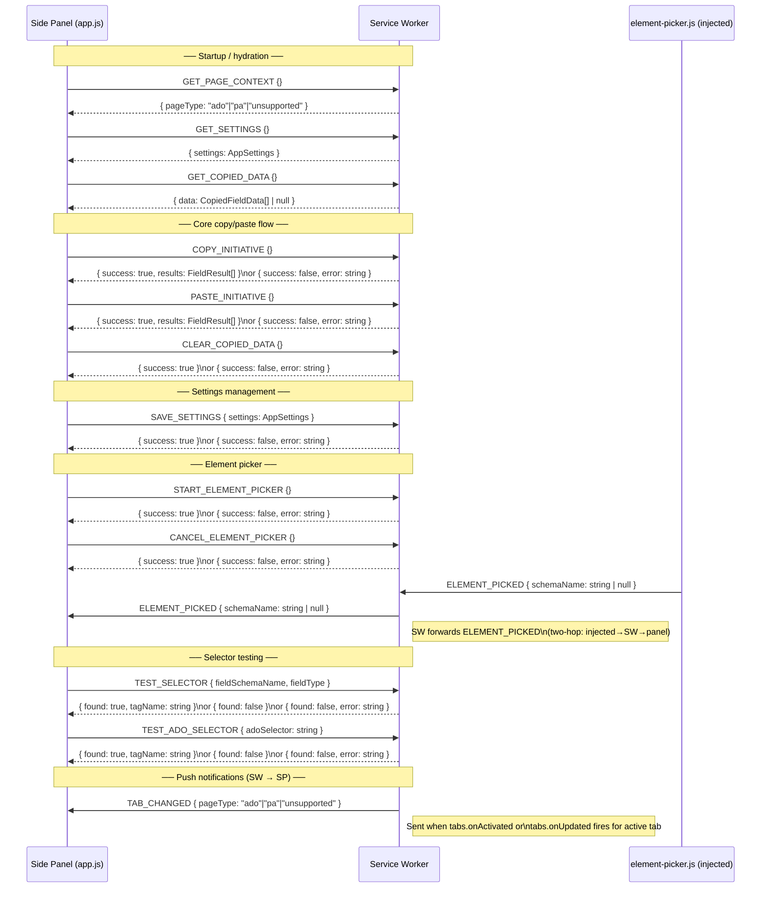
```mermaid
sequenceDiagram
    participant SP as Side Panel (app.js)
    participant SW as Service Worker
    participant PICKER as element-picker.js (injected)

    Note over SP,SW: ── Startup / hydration ──

    SP->>SW: GET_PAGE_CONTEXT {}
    SW-->>SP: { pageType: "ado"|"pa"|"unsupported" }

    SP->>SW: GET_SETTINGS {}
    SW-->>SP: { settings: AppSettings }

    SP->>SW: GET_COPIED_DATA {}
    SW-->>SP: { data: CopiedFieldData[] | null }

    Note over SP,SW: ── Core copy/paste flow ──

    SP->>SW: COPY_INITIATIVE {}
    SW-->>SP: { success: true, results: FieldResult[] }\nor { success: false, error: string }

    SP->>SW: PASTE_INITIATIVE {}
    SW-->>SP: { success: true, results: FieldResult[] }\nor { success: false, error: string }

    SP->>SW: CLEAR_COPIED_DATA {}
    SW-->>SP: { success: true }\nor { success: false, error: string }

    Note over SP,SW: ── Settings management ──

    SP->>SW: SAVE_SETTINGS { settings: AppSettings }
    SW-->>SP: { success: true }\nor { success: false, error: string }

    Note over SP,SW: ── Element picker ──

    SP->>SW: START_ELEMENT_PICKER {}
    SW-->>SP: { success: true }\nor { success: false, error: string }

    SP->>SW: CANCEL_ELEMENT_PICKER {}
    SW-->>SP: { success: true }\nor { success: false, error: string }

    PICKER->>SW: ELEMENT_PICKED { schemaName: string | null }
    SW->>SP: ELEMENT_PICKED { schemaName: string | null }
    Note right of SW: SW forwards ELEMENT_PICKED\n(two-hop: injected→SW→panel)

    Note over SP,SW: ── Selector testing ──

    SP->>SW: TEST_SELECTOR { fieldSchemaName, fieldType }
    SW-->>SP: { found: true, tagName: string }\nor { found: false }\nor { found: false, error: string }

    SP->>SW: TEST_ADO_SELECTOR { adoSelector: string }
    SW-->>SP: { found: true, tagName: string }\nor { found: false }\nor { found: false, error: string }

    Note over SW,SP: ── Push notifications (SW → SP) ──

    SW->>SP: TAB_CHANGED { pageType: "ado"|"pa"|"unsupported" }
    Note right of SW: Sent when tabs.onActivated or\ntabs.onUpdated fires for active tab
```

---

## 3. Chrome Storage Schema

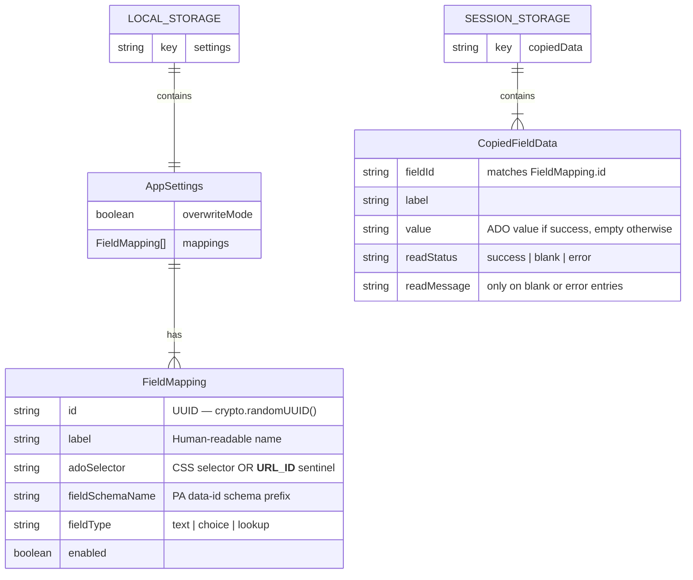
```mermaid
erDiagram
    LOCAL_STORAGE {
        string key "settings"
    }
    SESSION_STORAGE {
        string key "copiedData"
    }

    AppSettings {
        boolean overwriteMode
        FieldMapping[] mappings
    }
    FieldMapping {
        string id "UUID — crypto.randomUUID()"
        string label "Human-readable name"
        string adoSelector "CSS selector OR __URL_ID__ sentinel"
        string fieldSchemaName "PA data-id schema prefix"
        string fieldType "text | choice | lookup"
        boolean enabled
    }
    CopiedFieldData {
        string fieldId "matches FieldMapping.id"
        string label
        string value "ADO value if success, empty otherwise"
        string readStatus "success | blank | error"
        string readMessage "only on blank or error entries"
    }

    LOCAL_STORAGE ||--|| AppSettings : contains
    AppSettings ||--|{ FieldMapping : has
    SESSION_STORAGE ||--|{ CopiedFieldData : contains
```

---

## 4. Service Worker Startup & Tab Detection

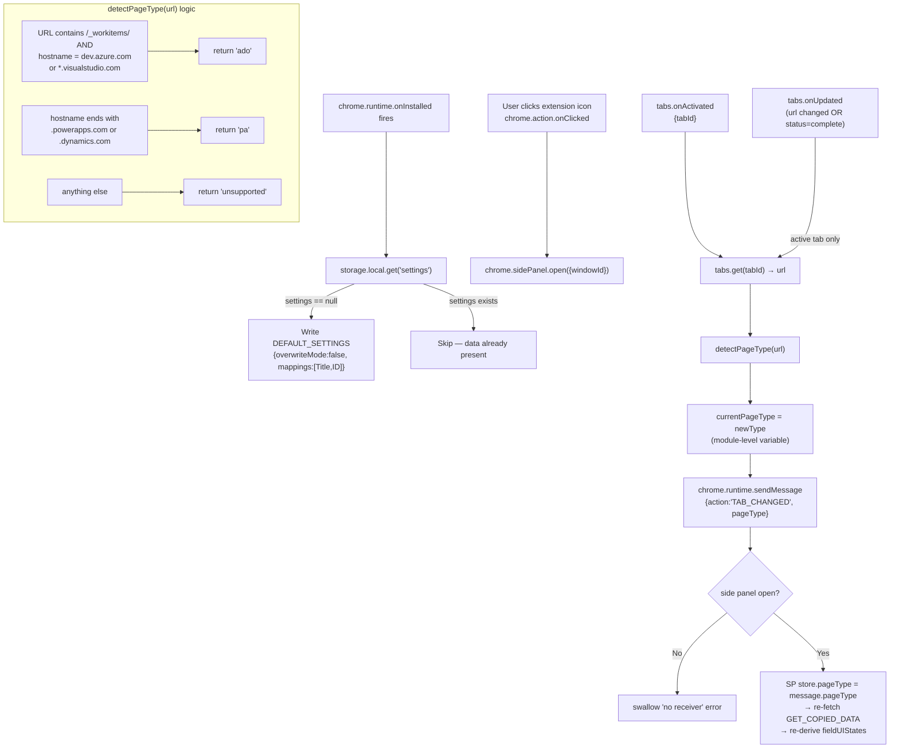
```mermaid
flowchart TD
    INSTALL["chrome.runtime.onInstalled fires"]
    CHECK["storage.local.get('settings')"]
    SEED["Write DEFAULT_SETTINGS\n{overwriteMode:false, mappings:[Title,ID]}"]
    SKIP["Skip — data already present"]

    INSTALL --> CHECK
    CHECK -->|settings == null| SEED
    CHECK -->|settings exists| SKIP

    ACTION["User clicks extension icon\nchrome.action.onClicked"]
    OPEN["chrome.sidePanel.open({windowId})"]
    ACTION --> OPEN

    ACTIVATED["tabs.onActivated\n{tabId}"]
    UPDATED["tabs.onUpdated\n(url changed OR status=complete)"]
    GET_TAB["tabs.get(tabId) → url"]
    DETECT["detectPageType(url)"]
    CACHE["currentPageType = newType\n(module-level variable)"]
    PUSH["chrome.runtime.sendMessage\n{action:'TAB_CHANGED', pageType}"]
    PANEL_OPEN{"side panel open?"}
    LOG["swallow 'no receiver' error"]

    ACTIVATED --> GET_TAB
    UPDATED -->|active tab only| GET_TAB
    GET_TAB --> DETECT
    DETECT --> CACHE
    CACHE --> PUSH
    PUSH --> PANEL_OPEN
    PANEL_OPEN -->|No| LOG
    PANEL_OPEN -->|Yes| SP_UPDATE["SP store.pageType = message.pageType\n→ re-fetch GET_COPIED_DATA\n→ re-derive fieldUIStates"]

    subgraph "detectPageType(url) logic"
        D1["URL contains /_workitems/ AND\nhostname = dev.azure.com\nor *.visualstudio.com"]
        D2["hostname ends with\n.powerapps.com or .dynamics.com"]
        D3["anything else"]
        D1 --> ADO["return 'ado'"]
        D2 --> PA["return 'pa'"]
        D3 --> UNS["return 'unsupported'"]
    end
```

---

## 5. Side Panel Initialization Sequence

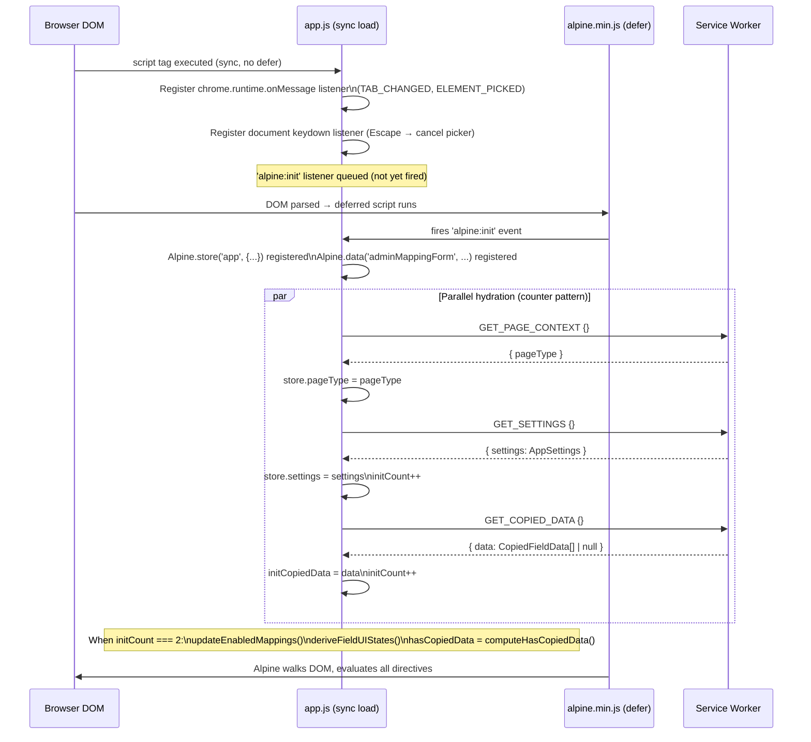
```mermaid
sequenceDiagram
    participant DOM as Browser DOM
    participant APP as app.js (sync load)
    participant ALPINE as alpine.min.js (defer)
    participant SW as Service Worker

    DOM->>APP: script tag executed (sync, no defer)
    APP->>APP: Register chrome.runtime.onMessage listener\n(TAB_CHANGED, ELEMENT_PICKED)
    APP->>APP: Register document keydown listener (Escape → cancel picker)
    Note over APP: 'alpine:init' listener queued (not yet fired)

    DOM->>ALPINE: DOM parsed → deferred script runs
    ALPINE->>APP: fires 'alpine:init' event
    APP->>APP: Alpine.store('app', {...}) registered\nAlpine.data('adminMappingForm', ...) registered

    par Parallel hydration (counter pattern)
        APP->>SW: GET_PAGE_CONTEXT {}
        SW-->>APP: { pageType }
        APP->>APP: store.pageType = pageType

        APP->>SW: GET_SETTINGS {}
        SW-->>APP: { settings: AppSettings }
        APP->>APP: store.settings = settings\ninitCount++

        APP->>SW: GET_COPIED_DATA {}
        SW-->>APP: { data: CopiedFieldData[] | null }
        APP->>APP: initCopiedData = data\ninitCount++
    end

    Note over APP: When initCount === 2:\nupdateEnabledMappings()\nderiveFieldUIStates()\nhasCopiedData = computeHasCopiedData()

    ALPINE->>DOM: Alpine walks DOM, evaluates all directives
```

---

## 6. Copy Initiative Flow (COPY_INITIATIVE)

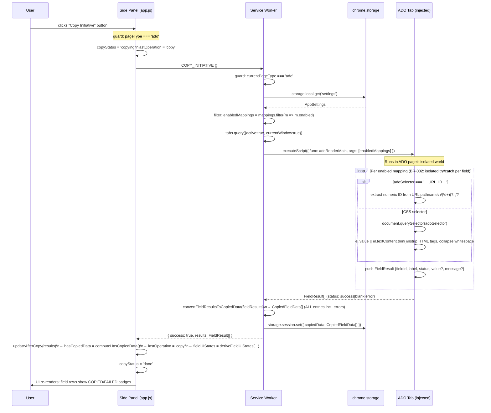
```mermaid
sequenceDiagram
    participant USER as User
    participant SP as Side Panel (app.js)
    participant SW as Service Worker
    participant STORE as chrome.storage
    participant ADO as ADO Tab (injected)

    USER->>SP: clicks "Copy Initiative" button
    Note over SP: guard: pageType === 'ado'
    SP->>SP: copyStatus = 'copying'\nlastOperation = 'copy'
    SP->>SW: COPY_INITIATIVE {}

    SW->>SW: guard: currentPageType === 'ado'
    SW->>STORE: storage.local.get('settings')
    STORE-->>SW: AppSettings
    SW->>SW: filter: enabledMappings = mappings.filter(m => m.enabled)

    SW->>SW: tabs.query({active:true, currentWindow:true})
    SW->>ADO: executeScript({ func: adoReaderMain, args: [enabledMappings] })

    Note over ADO: Runs in ADO page's isolated world
    loop Per enabled mapping (BR-002: isolated try/catch per field)
        alt adoSelector === '__URL_ID__'
            ADO->>ADO: extract numeric ID from URL pathname\n/(\d+)(?:[/?#]|$)/
        else CSS selector
            ADO->>ADO: document.querySelector(adoSelector)
            ADO->>ADO: el.value || el.textContent.trim()\nstrip HTML tags, collapse whitespace
        end
        ADO->>ADO: push FieldResult {fieldId, label, status, value?, message?}
    end
    ADO-->>SW: FieldResult[] (status: success|blank|error)

    SW->>SW: convertFieldResultsToCopiedData(fieldResults)\n→ CopiedFieldData[] (ALL entries incl. errors)
    SW->>STORE: storage.session.set({ copiedData: CopiedFieldData[] })
    SW-->>SP: { success: true, results: FieldResult[] }

    SP->>SP: updateAfterCopy(results)\n→ hasCopiedData = computeHasCopiedData()\n→ lastOperation = 'copy'\n→ fieldUIStates = deriveFieldUIStates(...)
    SP->>SP: copyStatus = 'done'
    SP->>USER: UI re-renders: field rows show COPIED/FAILED badges
```

---

## 7. Paste Initiative Flow (PASTE_INITIATIVE)

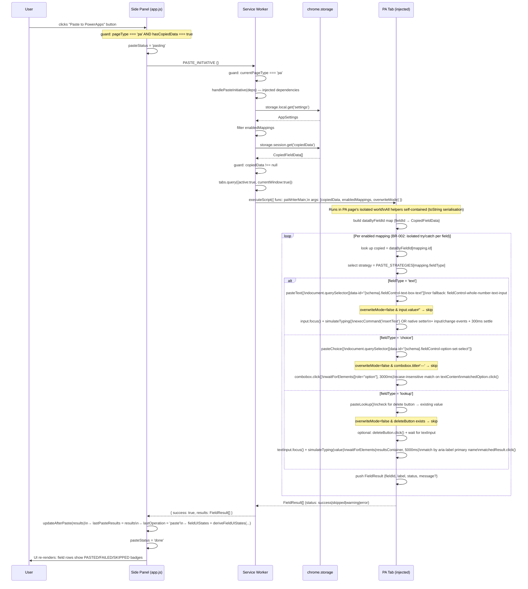
```mermaid
sequenceDiagram
    participant USER as User
    participant SP as Side Panel (app.js)
    participant SW as Service Worker
    participant STORE as chrome.storage
    participant PA as PA Tab (injected)

    USER->>SP: clicks "Paste to PowerApps" button
    Note over SP: guard: pageType === 'pa' AND hasCopiedData === true
    SP->>SP: pasteStatus = 'pasting'
    SP->>SW: PASTE_INITIATIVE {}

    SW->>SW: guard: currentPageType === 'pa'
    SW->>SW: handlePasteInitiative(deps) — injected dependencies

    SW->>STORE: storage.local.get('settings')
    STORE-->>SW: AppSettings
    SW->>SW: filter enabledMappings

    SW->>STORE: storage.session.get('copiedData')
    STORE-->>SW: CopiedFieldData[]
    SW->>SW: guard: copiedData !== null

    SW->>SW: tabs.query({active:true, currentWindow:true})
    SW->>PA: executeScript({ func: paWriterMain,\n args: [copiedData, enabledMappings, overwriteMode] })

    Note over PA: Runs in PA page's isolated world\nAll helpers self-contained (toString serialisation)

    PA->>PA: build dataByFieldId map {fieldId → CopiedFieldData}
    loop Per enabled mapping (BR-002: isolated try/catch per field)
        PA->>PA: look up copied = dataByFieldId[mapping.id]
        PA->>PA: select strategy = PASTE_STRATEGIES[mapping.fieldType]
        alt fieldType = 'text'
            PA->>PA: pasteText()\ndocument.querySelector([data-id="{schema}.fieldControl-text-box-text"])\nor fallback: fieldControl-whole-number-text-input
            Note over PA: overwriteMode=false & input.value≠'' → skip
            PA->>PA: input.focus() + simulateTyping()\nexecCommand('insertText') OR native setter\n+ input/change events + 300ms settle
        else fieldType = 'choice'
            PA->>PA: pasteChoice()\ndocument.querySelector([data-id="{schema}.fieldControl-option-set-select"])
            Note over PA: overwriteMode=false & combobox.title≠'---' → skip
            PA->>PA: combobox.click()\nwaitForElements([role="option"], 3000ms)\ncase-insensitive match on textContent\nmatchedOption.click()
        else fieldType = 'lookup'
            PA->>PA: pasteLookup()\ncheck for delete button → existing value
            Note over PA: overwriteMode=false & deleteButton exists → skip
            PA->>PA: optional: deleteButton.click() + wait for textInput
            PA->>PA: textInput.focus() + simulateTyping(value)\nwaitForElements(resultsContainer, 5000ms)\nmatch by aria-label primary name\nmatchedResult.click()
        end
        PA->>PA: push FieldResult {fieldId, label, status, message?}
    end
    PA-->>SW: FieldResult[] (status: success|skipped|warning|error)

    SW-->>SP: { success: true, results: FieldResult[] }

    SP->>SP: updateAfterPaste(results)\n→ lastPasteResults = results\n→ lastOperation = 'paste'\n→ fieldUIStates = deriveFieldUIStates(...)
    SP->>SP: pasteStatus = 'done'
    SP->>USER: UI re-renders: field rows show PASTED/FAILED/SKIPPED badges
```

---

## 8. Element Picker Flow

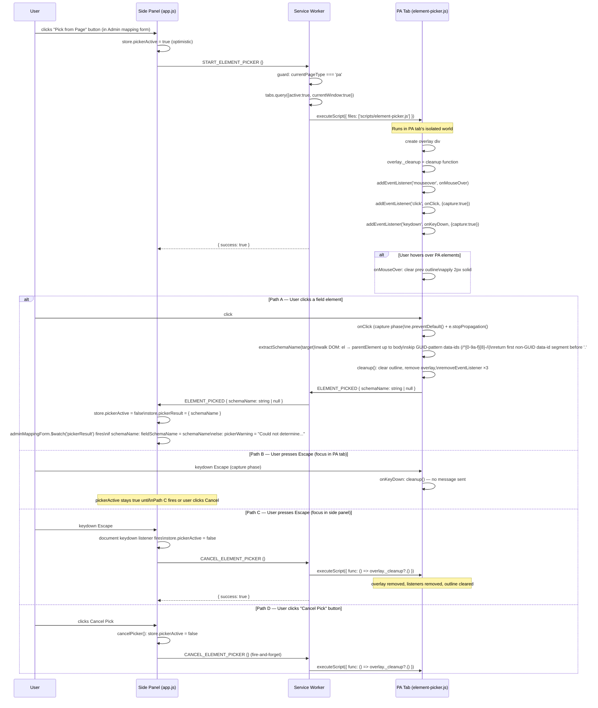
```mermaid
sequenceDiagram
    participant USER as User
    participant SP as Side Panel (app.js)
    participant SW as Service Worker
    participant PA as PA Tab (element-picker.js)

    USER->>SP: clicks "Pick from Page" button (in Admin mapping form)
    SP->>SP: store.pickerActive = true (optimistic)
    SP->>SW: START_ELEMENT_PICKER {}

    SW->>SW: guard: currentPageType === 'pa'
    SW->>SW: tabs.query({active:true, currentWindow:true})
    SW->>PA: executeScript({ files: ['scripts/element-picker.js'] })

    Note over PA: Runs in PA tab's isolated world
    PA->>PA: create overlay div#ado-pa-picker-overlay\n(position:fixed, z-index:max, pointer-events:none)
    PA->>PA: overlay._cleanup = cleanup function
    PA->>PA: addEventListener('mouseover', onMouseOver)
    PA->>PA: addEventListener('click', onClick, {capture:true})
    PA->>PA: addEventListener('keydown', onKeyDown, {capture:true})

    SW-->>SP: { success: true }

    alt User hovers over PA elements
        PA->>PA: onMouseOver: clear prev outline\napply 2px solid #4f9cf9 outline to hovered element
    end

    alt Path A — User clicks a field element
        USER->>PA: click
        PA->>PA: onClick (capture phase)\ne.preventDefault() + e.stopPropagation()
        PA->>PA: extractSchemaName(target)\nwalk DOM: el → parentElement up to body\nskip GUID-pattern data-ids (/^[0-9a-f]{8}-/i)\nreturn first non-GUID data-id segment before '.'
        PA->>PA: cleanup(): clear outline, remove overlay,\nremoveEventListener ×3
        PA->>SW: ELEMENT_PICKED { schemaName: string | null }
        SW->>SP: ELEMENT_PICKED { schemaName: string | null }
        SP->>SP: store.pickerActive = false\nstore.pickerResult = { schemaName }
        SP->>SP: adminMappingForm.$watch('pickerResult') fires\nif schemaName: fieldSchemaName = schemaName\nelse: pickerWarning = "Could not determine..."

    else Path B — User presses Escape (focus in PA tab)
        USER->>PA: keydown Escape (capture phase)
        PA->>PA: onKeyDown: cleanup() — no message sent
        Note over SP: pickerActive stays true until\nPath C fires or user clicks Cancel

    else Path C — User presses Escape (focus in side panel)
        USER->>SP: keydown Escape
        SP->>SP: document keydown listener fires\nstore.pickerActive = false
        SP->>SW: CANCEL_ELEMENT_PICKER {}
        SW->>PA: executeScript({ func: () => overlay._cleanup?.() })
        Note over PA: overlay removed, listeners removed, outline cleared
        SW-->>SP: { success: true }

    else Path D — User clicks "Cancel Pick" button
        USER->>SP: clicks Cancel Pick
        SP->>SP: cancelPicker(): store.pickerActive = false
        SP->>SW: CANCEL_ELEMENT_PICKER {} (fire-and-forget)
        SW->>PA: executeScript({ func: () => overlay._cleanup?.() })
    end
```

---

## 9. Selector Tester Flows

### 9a. Test PA Field (TEST_SELECTOR)

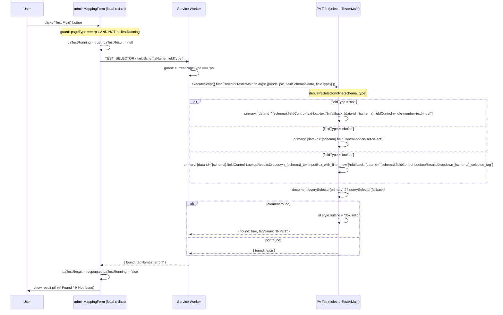
```mermaid
sequenceDiagram
    participant USER as User
    participant FORM as adminMappingForm (local x-data)
    participant SW as Service Worker
    participant PA as PA Tab (selectorTesterMain)

    USER->>FORM: clicks "Test Field" button
    Note over FORM: guard: pageType === 'pa' AND NOT paTestRunning
    FORM->>FORM: paTestRunning = true\npaTestResult = null
    FORM->>SW: TEST_SELECTOR { fieldSchemaName, fieldType }

    SW->>SW: guard: currentPageType === 'pa'
    SW->>PA: executeScript({ func: selectorTesterMain,\n args: [{mode:'pa', fieldSchemaName, fieldType}] })

    Note over PA: derivePaSelectorInline(schema, type):
    alt fieldType = 'text'
        PA->>PA: primary: [data-id="{schema}.fieldControl-text-box-text"]\nfallback: [data-id="{schema}.fieldControl-whole-number-text-input"]
    else fieldType = 'choice'
        PA->>PA: primary: [data-id="{schema}.fieldControl-option-set-select"]
    else fieldType = 'lookup'
        PA->>PA: primary: [data-id="{schema}.fieldControl-LookupResultsDropdown_{schema}_textInputBox_with_filter_new"]\nfallback: [data-id="{schema}.fieldControl-LookupResultsDropdown_{schema}_selected_tag"]
    end
    PA->>PA: document.querySelector(primary) ?? querySelector(fallback)
    alt element found
        PA->>PA: el.style.outline = '3px solid #22c55e'\nsetTimeout restore, 2000ms
        PA-->>SW: { found: true, tagName: "INPUT" }
    else not found
        PA-->>SW: { found: false }
    end

    SW-->>FORM: { found, tagName?, error? }
    FORM->>FORM: paTestResult = response\npaTestRunning = false
    FORM->>USER: show result pill (✅ Found / ❌ Not found)
```

### 9b. Test ADO Selector (TEST_ADO_SELECTOR)

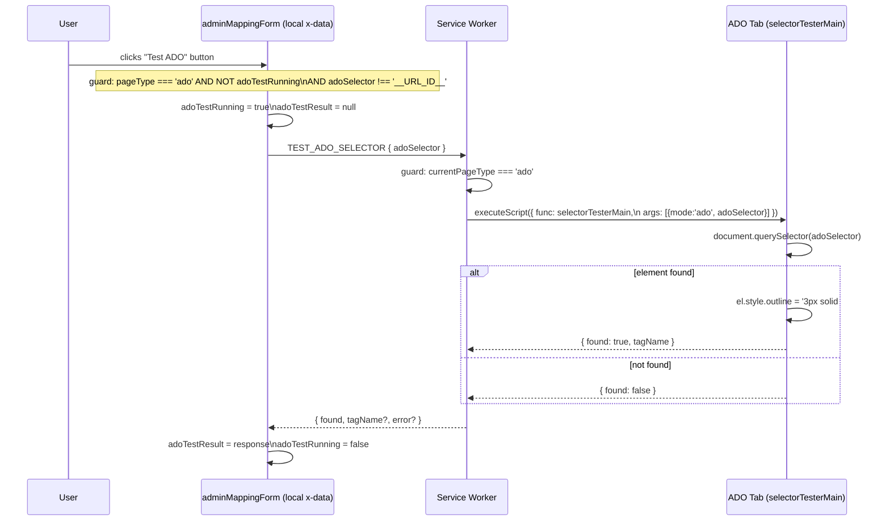
```mermaid
sequenceDiagram
    participant USER as User
    participant FORM as adminMappingForm (local x-data)
    participant SW as Service Worker
    participant ADO as ADO Tab (selectorTesterMain)

    USER->>FORM: clicks "Test ADO" button
    Note over FORM: guard: pageType === 'ado' AND NOT adoTestRunning\nAND adoSelector !== '__URL_ID__'
    FORM->>FORM: adoTestRunning = true\nadoTestResult = null
    FORM->>SW: TEST_ADO_SELECTOR { adoSelector }

    SW->>SW: guard: currentPageType === 'ado'
    SW->>ADO: executeScript({ func: selectorTesterMain,\n args: [{mode:'ado', adoSelector}] })

    ADO->>ADO: document.querySelector(adoSelector)
    alt element found
        ADO->>ADO: el.style.outline = '3px solid #22c55e' (2s)
        ADO-->>SW: { found: true, tagName }
    else not found
        ADO-->>SW: { found: false }
    end

    SW-->>FORM: { found, tagName?, error? }
    FORM->>FORM: adoTestResult = response\nadoTestRunning = false
```

---

## 10. Admin Settings CRUD Flows

### 10a. Add / Edit Mapping

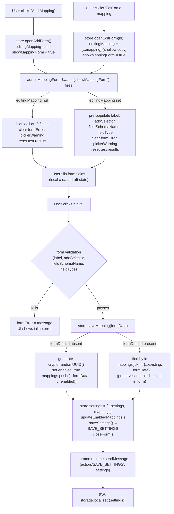
```mermaid
flowchart TD
    ADD["User clicks 'Add Mapping'"] --> OPEN_ADD["store.openAddForm()\neditingMapping = null\nshowMappingForm = true"]
    EDIT["User clicks 'Edit' on a mapping"] --> OPEN_EDIT["store.openEditForm(id)\neditingMapping = {...mapping} (shallow copy)\nshowMappingForm = true"]

    OPEN_ADD --> WATCH["adminMappingForm.$watch('showMappingForm') fires"]
    OPEN_EDIT --> WATCH

    WATCH -->|editingMapping null| BLANK["blank all draft fields\nclear formError, pickerWarning\nreset test results"]
    WATCH -->|editingMapping set| PREPOP["pre-populate label, adoSelector,\nfieldSchemaName, fieldType\nclear formError, pickerWarning\nreset test results"]

    BLANK --> FORM["User fills form fields\n(local x-data draft state)"]
    PREPOP --> FORM

    FORM --> SAVE["User clicks 'Save'"]
    SAVE --> VALIDATE{"form validation\n(label, adoSelector,\nfieldSchemaName, fieldType)"}
    VALIDATE -->|fails| ERROR["formError = message\nUI shows inline error"]
    VALIDATE -->|passes| DELEGATE["store.saveMapping(formData)"]

    DELEGATE -->|formData.id absent| NEW_MAP["generate crypto.randomUUID()\nset enabled: true\nmappings.push({...formData, id, enabled})"]
    DELEGATE -->|formData.id present| EDIT_MAP["find by id\nmappings[idx] = {...existing, ...formData}\n(preserves 'enabled' — not in form)"]

    NEW_MAP --> PERSIST["store.settings = {...settings, mappings}\nupdateEnabledMappings()\n_saveSettings() → SAVE_SETTINGS\ncloseForm()"]
    EDIT_MAP --> PERSIST

    PERSIST --> SEND["chrome.runtime.sendMessage\n{action:'SAVE_SETTINGS', settings}"]
    SEND --> SW_SAVE["SW: storage.local.set({settings})"]
```

### 10b. Delete / Toggle / Overwrite Mode

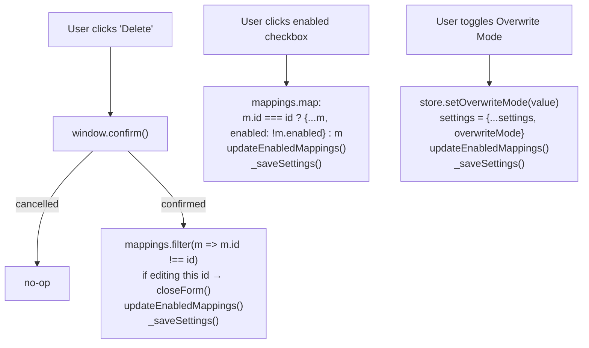
```mermaid
flowchart TD
    DEL["User clicks 'Delete'"] --> CONFIRM["window.confirm()"]
    CONFIRM -->|cancelled| STOP["no-op"]
    CONFIRM -->|confirmed| FILTER["mappings.filter(m => m.id !== id)\nif editing this id → closeForm()\nupdateEnabledMappings()\n_saveSettings()"]

    TOGGLE["User clicks enabled checkbox"] --> FLIP["mappings.map:\nm.id === id ? {...m, enabled: !m.enabled} : m\nupdateEnabledMappings()\n_saveSettings()"]

    OW["User toggles Overwrite Mode"] --> OW_SET["store.setOverwriteMode(value)\nsettings = {...settings, overwriteMode}\nupdateEnabledMappings()\n_saveSettings()"]
```

### 10c. Export / Import

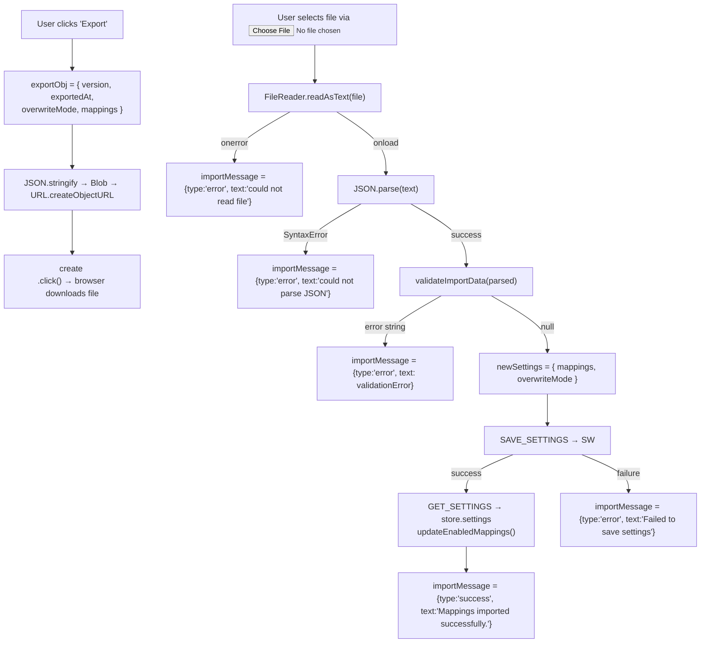
```mermaid
flowchart TD
    EXPORT["User clicks 'Export'"] --> BUILD["exportObj = { version, exportedAt,\noverwriteMode, mappings }"]
    BUILD --> BLOB["JSON.stringify → Blob → URL.createObjectURL"]
    BLOB --> ANCHOR["create <a download='ado-pa-mappings.json'>\n.click() → browser downloads file"]

    IMPORT["User selects file via <input type=file>"] --> READ["FileReader.readAsText(file)"]
    READ -->|onerror| IOERR["importMessage = {type:'error', text:'could not read file'}"]
    READ -->|onload| PARSE["JSON.parse(text)"]
    PARSE -->|SyntaxError| JERR["importMessage = {type:'error', text:'could not parse JSON'}"]
    PARSE -->|success| VALIDATE["validateImportData(parsed)"]
    VALIDATE -->|error string| VERR["importMessage = {type:'error', text: validationError}"]
    VALIDATE -->|null| BUILD_NEW["newSettings = { mappings, overwriteMode }"]
    BUILD_NEW --> SEND_SAVE["SAVE_SETTINGS → SW"]
    SEND_SAVE -->|success| REFETCH["GET_SETTINGS → store.settings\nupdateEnabledMappings()"]
    REFETCH --> OK["importMessage = {type:'success', text:'Mappings imported successfully.'}"]
    SEND_SAVE -->|failure| SERR["importMessage = {type:'error', text:'Failed to save settings'}"]
```

---

## 11. Field UI State Machine

Each enabled mapping has one `FieldUIState` at any given moment. This diagram shows all states and the transitions.

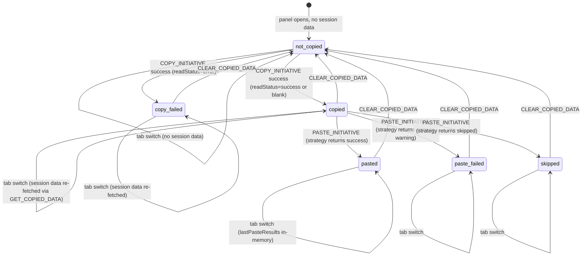
```mermaid
stateDiagram-v2
    [*] --> not_copied : panel opens, no session data

    not_copied --> copied : COPY_INITIATIVE success (readStatus=success or blank)
    not_copied --> copy_failed : COPY_INITIATIVE success (readStatus=error)

    copied --> pasted : PASTE_INITIATIVE (strategy returns success)
    copied --> paste_failed : PASTE_INITIATIVE (strategy returns error or warning)
    copied --> skipped : PASTE_INITIATIVE (strategy returns skipped)
    copied --> not_copied : CLEAR_COPIED_DATA

    copy_failed --> not_copied : CLEAR_COPIED_DATA
    pasted --> not_copied : CLEAR_COPIED_DATA
    paste_failed --> not_copied : CLEAR_COPIED_DATA
    skipped --> not_copied : CLEAR_COPIED_DATA

    not_copied --> not_copied : tab switch (no session data)
    copied --> copied : tab switch (session data re-fetched via GET_COPIED_DATA)
    copy_failed --> copy_failed : tab switch (session data re-fetched)
    pasted --> pasted : tab switch (lastPasteResults in-memory)
    paste_failed --> paste_failed : tab switch
    skipped --> skipped : tab switch
```

### State → UI Rendering Map

| State | Icon | Badge | Secondary Line |
|-------|------|-------|----------------|
| `not_copied` | ○ | NOT COPIED (grey) | — |
| `copied` | ● | COPIED (blue) | copiedValue (if non-empty) |
| `copy_failed` | ✕ | FAILED (red) | readMessage |
| `pasted` | ✓ | PASTED (green) | copiedValue (if non-empty) |
| `paste_failed` | ✕ | FAILED (red) | copiedValue + " — " + message |
| `skipped` | ⊘ | SKIPPED (yellow) | copiedValue + " — " + message |

---

## 12. `deriveFieldUIStates` Logic

The central pure function that translates raw data into `FieldUIState[]`.

```mermaid
flowchart TD
    INPUT["deriveFieldUIStates(\n  enabledMappings[],\n  copiedData[] | null,\n  lastPasteResults[] | null,\n  lastOperation: 'copy'|'paste'|null\n)"]

    INPUT --> LOOP["for each mapping m in enabledMappings"]

    LOOP --> LOOKUP["copiedItem = copiedData?.find(d => d.fieldId === m.id)\npasteResult = lastPasteResults?.find(r => r.fieldId === m.id)"]

    LOOKUP --> PASTE_CHECK{"lastOperation === 'paste'\nAND pasteResult !== null?"}

    PASTE_CHECK -->|Yes| PS{"pasteResult.status"}
    PS -->|"success"| PASTED["state: 'pasted'\ncopiedValue from copiedItem\nmessage: null"]
    PS -->|"error" or "warning"| PASTE_FAIL["state: 'paste_failed'\ncopiedValue from copiedItem\nmessage: pasteResult.message"]
    PS -->|"skipped" or "blank"| SKIPPED["state: 'skipped'\ncopiedValue from copiedItem\nmessage: pasteResult.message"]

    PASTE_CHECK -->|No| COPY_CHECK{"copiedItem !== null?"}
    COPY_CHECK -->|Yes| RS{"copiedItem.readStatus"}
    RS -->|"success"| COPIED["state: 'copied'\ncopiedValue: copiedItem.value"]
    RS -->|"blank"| COPIED_BLANK["state: 'copied'\ncopiedValue: ''"]
    RS -->|"error"| COPY_FAIL["state: 'copy_failed'\ncopiedValue: null\nmessage: copiedItem.readMessage"]

    COPY_CHECK -->|No| NOT_COPIED["state: 'not_copied'\ncopiedValue: null\nmessage: null"]
```

---

## 13. PA Writer Strategy Architecture

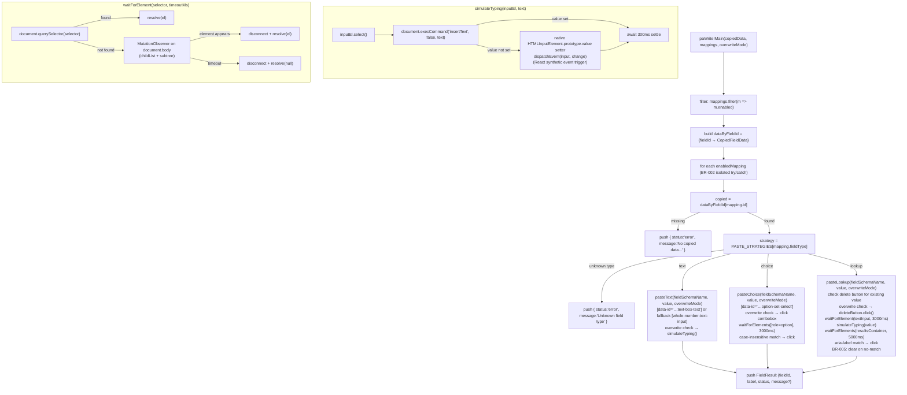
```mermaid
graph TD
    MAIN["paWriterMain(copiedData, mappings, overwriteMode)"]
    MAIN --> FILTER["filter: mappings.filter(m => m.enabled)"]
    FILTER --> MAP["build dataByFieldId = {fieldId → CopiedFieldData}"]
    MAP --> LOOP["for each enabledMapping (BR-002 isolated try/catch)"]
    LOOP --> LOOKUP["copied = dataByFieldId[mapping.id]"]
    LOOKUP -->|missing| ERR_NO_DATA["push { status:'error', message:'No copied data...' }"]
    LOOKUP -->|found| STRATEGY["strategy = PASTE_STRATEGIES[mapping.fieldType]"]
    STRATEGY -->|unknown type| ERR_TYPE["push { status:'error', message:'Unknown field type' }"]

    STRATEGY -->|"text"| TEXT["pasteText(fieldSchemaName, value, overwriteMode)\n[data-id='…text-box-text'] or fallback [whole-number-text-input]\noverwrite check → simulateTyping()"]
    STRATEGY -->|"choice"| CHOICE["pasteChoice(fieldSchemaName, value, overwriteMode)\n[data-id='…option-set-select']\noverwrite check → click combobox\nwaitForElements([role=option], 3000ms)\ncase-insensitive match → click"]
    STRATEGY -->|"lookup"| LOOKUP_S["pasteLookup(fieldSchemaName, value, overwriteMode)\ncheck delete button for existing value\noverwrite check → deleteButton.click()\nwaitForElement(textInput, 3000ms)\nsimulateTyping(value)\nwaitForElements(resultsContainer, 5000ms)\naria-label match → click\nBR-005: clear on no-match"]

    TEXT --> RESULT["push FieldResult {fieldId, label, status, message?}"]
    CHOICE --> RESULT
    LOOKUP_S --> RESULT

    subgraph "simulateTyping(inputEl, text)"
        ST1["inputEl.select()"]
        ST1 --> ST2["document.execCommand('insertText', false, text)"]
        ST2 -->|value not set| ST3["native HTMLInputElement.prototype.value setter\ndispatchEvent(input, change)\n(React synthetic event trigger)"]
        ST2 -->|value set| ST4["await 300ms settle"]
        ST3 --> ST4
    end

    subgraph "waitForElement(selector, timeoutMs)"
        WE1["document.querySelector(selector)"]
        WE1 -->|found| WE2["resolve(el)"]
        WE1 -->|not found| WE3["MutationObserver on document.body\n(childList + subtree)"]
        WE3 -->|element appears| WE4["disconnect + resolve(el)"]
        WE3 -->|timeout| WE5["disconnect + resolve(null)"]
    end
```

---

## 14. Script Loading & Isolation Model

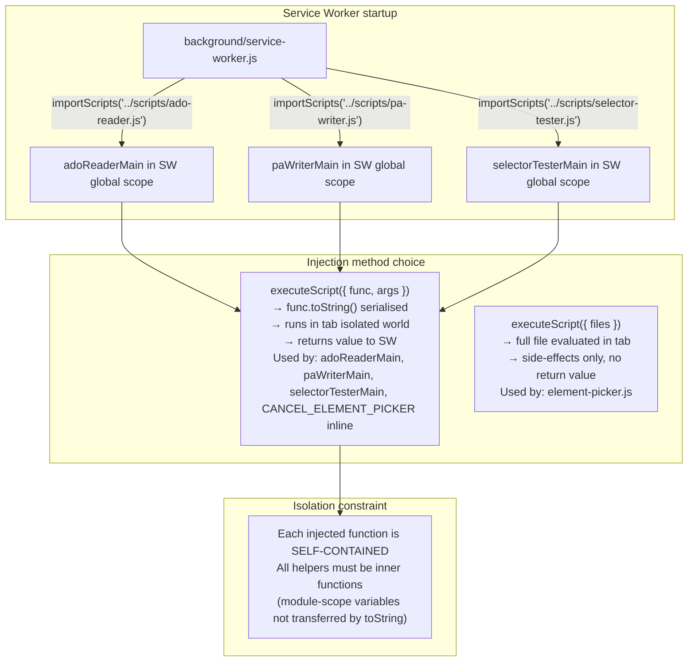
```mermaid
graph TD
    subgraph "Service Worker startup"
        SW_JS["background/service-worker.js"]
        SW_JS -->|"importScripts('../scripts/ado-reader.js')"| ADO_GLOBAL["adoReaderMain in SW global scope"]
        SW_JS -->|"importScripts('../scripts/selector-tester.js')"| TESTER_GLOBAL["selectorTesterMain in SW global scope"]
        SW_JS -->|"importScripts('../scripts/pa-writer.js')"| WRITER_GLOBAL["paWriterMain in SW global scope"]
    end

    subgraph "Injection method choice"
        FUNC_ARGS["executeScript({ func, args })\n→ func.toString() serialised\n→ runs in tab isolated world\n→ returns value to SW\nUsed by: adoReaderMain, paWriterMain, selectorTesterMain, CANCEL_ELEMENT_PICKER inline"]
        FILES["executeScript({ files })\n→ full file evaluated in tab\n→ side-effects only, no return value\nUsed by: element-picker.js"]
    end

    subgraph "Isolation constraint"
        ISO["Each injected function is SELF-CONTAINED\nAll helpers must be inner functions\n(module-scope variables not transferred by toString)"]
    end

    ADO_GLOBAL --> FUNC_ARGS
    WRITER_GLOBAL --> FUNC_ARGS
    TESTER_GLOBAL --> FUNC_ARGS
    FUNC_ARGS --> ISO
```

---

## 15. Key Data Types Reference

```
FieldMapping (stored in AppSettings.mappings):
  id:              string  — UUID
  label:           string  — e.g. "Title"
  adoSelector:     string  — CSS selector OR "__URL_ID__"
  fieldSchemaName: string  — e.g. "shg_title"
  fieldType:       "text" | "choice" | "lookup"
  enabled:         boolean

FieldResult (returned by adoReaderMain / paWriterMain):
  fieldId:  string
  label:    string
  status:   "success" | "blank" | "error" | "skipped" | "warning"
  value?:   string   — present on success
  message?: string   — present on blank/error/skipped/warning

CopiedFieldData (persisted to session storage):
  fieldId:      string
  label:        string
  value:        string   — ADO value if success, "" otherwise
  readStatus:   "success" | "blank" | "error"
  readMessage?: string   — only on blank or error

FieldUIState (derived in-memory, not persisted):
  fieldId:      string
  label:        string
  state:        "not_copied" | "copied" | "copy_failed" | "pasted" | "paste_failed" | "skipped"
  copiedValue:  string | null
  message:      string | null

AppSettings (chrome.storage.local key: 'settings'):
  overwriteMode: boolean
  mappings:      FieldMapping[]
```
